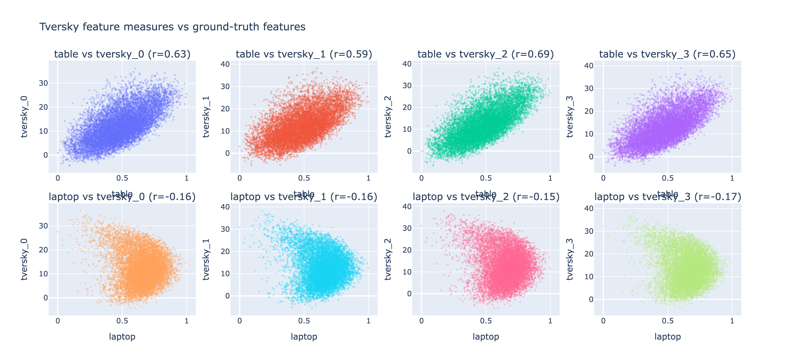

> The code in this experiment probably doesn't run as-is, Miranda copied it over directly from the SIRL repo and so the paths are all messed up. This is mostly here for documentation purposes.

Miranda's (messy, sorry) experiments trying to simplify / replicate SIRL FPE results on human-labelled Jacorobot trajectory data,
and subsequently integrate [Tversky similarity](https://mdoumbouya.github.io/article_0007_tversky_neural_networks.html).

Results:

As you can see, I got different FPE values than the paper for SIRL and the random baseline (for reference, the result I am trying to replicate is the left-hand bar chart of Figure 6 in the SIRL paper), which means we should take this with a grain of salt, but so far promising results showing good performance of Tversky-SIRL. I also implemented a PCA baseline which just tacks all the anchors, positives, and negatives in the training set together and fits a transform to the top 6 PCs, which performs surprisingly well.

# SIRL with TverskySimilarity in the TripletMarginLoss
Using Tversky-SIRL (`tversky_sirl.py`) with a feature bank size of 4 (best-performing feature bank size, see chart above), I did some more analysis on the learned Tversky feature bank to see if we can do semantic expressions.
After centering the embeddings (subtracting mean) we can get the least and most salient trajectories:

Here's 8 scatterplots of the learned Tversky features against each of the ground truth features ("table", "laptop"):

As we can see, the features are degenerate - they are learning the same information at different scales.
And, even worse, the trajectories with the max / min feature values for table / laptop have the same ordering of feature values, such that
e.g. [max table trajectory] - [min table trajectory] yields empty set.
On further investigation, the learned embeddings are also very ill-conditioned -- all values are large (on the order of 10,000s) and negative.

# SIRL with TverskyProjectionLayer instead of MDP, AND TverskySimilarity in the TripletMarginLoss
This method is implemented in `tversky_sirl_2.py`.
In my experiments, the FPE for this method was worse than random. However, since FPE measures the linear separability of learned features and Tversky is nonlinear by design, I figured it might be worth a try to see if semantic algebra were possible here / if a less ill-conditioned embedding was learned.

The TverskyProjection layer has a similar degeneracy issue as before...
TverskyProjection layer (replaces MLP in encoder):

But in the similarity layer we at least have something going on...
TverskySimilarity layer in triplet loss:

And semantic algebra queries (on the TverskySimilarity layer) work as we expect:

(we expect this to return trajs with high table values)
`table max - table min` query yields 10 trajectories with average table value of
0.7140224175242202 

(we expect this to return trajs with low table values)
`table min - table max` query yields 10 trajectories with average table value of
0.3241266846780063
(p < .001 t-test of means)

(we expect this to return trajs with high laptop values)
`laptop max - laptop min` query yields 10 trajectories with average table value of
0.5762385613823011 

(we expect this to return trajs with low laptop values)
`laptop min - laptop max` query yields 10 trajectories with average table value of
0.2774007666474871
(p < .001 t-test of means)