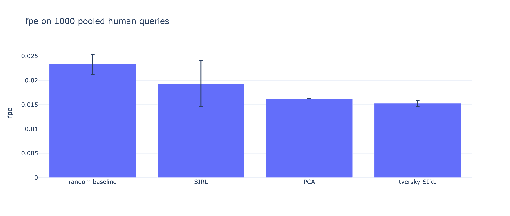
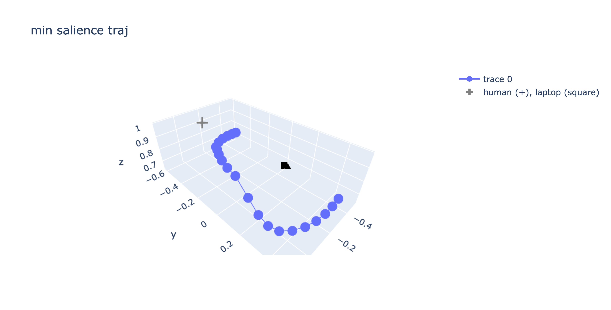
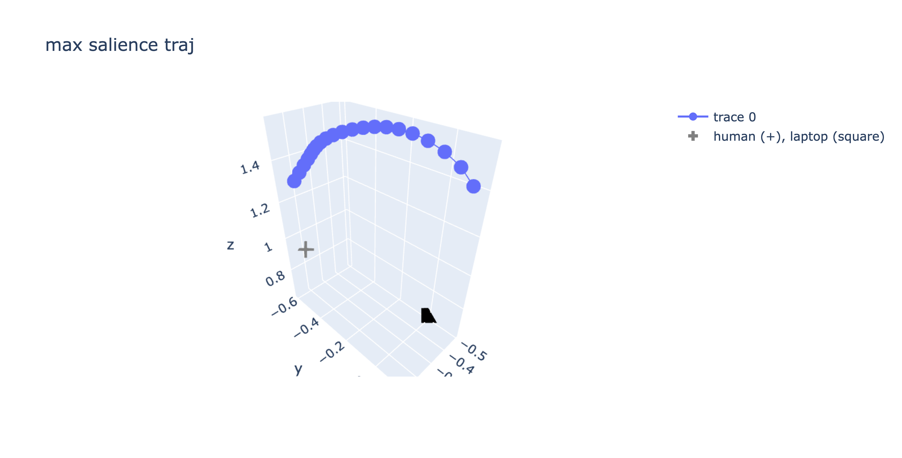
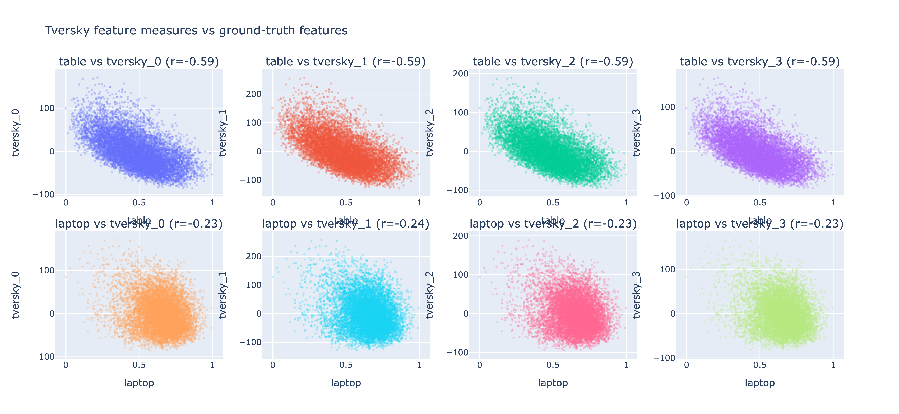

Miranda's (messy, sorry) experiments trying to simplify / replicate SIRL FPE results on human-labelled Jacorobot trajectory data,
and subsequently integrate [Tversky similarity](https://mdoumbouya.github.io/article_0007_tversky_neural_networks.html).

Results:

As you can see, I got different FPE values than the paper for SIRL and the random baseline (for reference, the result I am trying to replicate is the left-hand bar chart of Figure 6 in the SIRL paper), which means we should take this with a grain of salt, but so far promising results showing good performance of Tversky-SIRL. I also implemented a PCA baseline which just tacks all the anchors, positives, and negatives in the training set together and fits a transform to the top 6 PCs, which performs surprisingly well.

Using Tversky-SIRL with a feature bank size of 4 (best-performing feature bank size, see chart above), I did some more analysis on the learned Tversky feature bank to see if we can do semantic expressions.
After centering the embeddings (subtracting mean) we can get the least and most salient trajectories:

A sweep of each of the max and min trajectories across all of the 4 Tversky features indicates that these min and max salience trajectories also contain the min and max in each of the individual feature dimensions, respectively.

Here's 8 scatterplots of the learned Tversky features against each of the ground truth features ("table", "laptop"):

