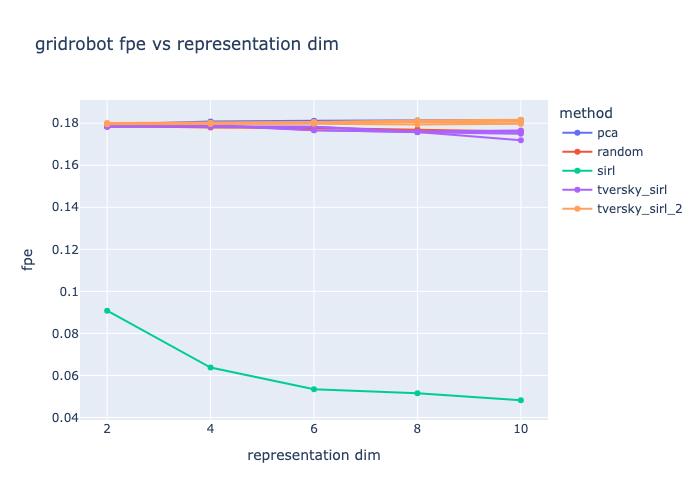
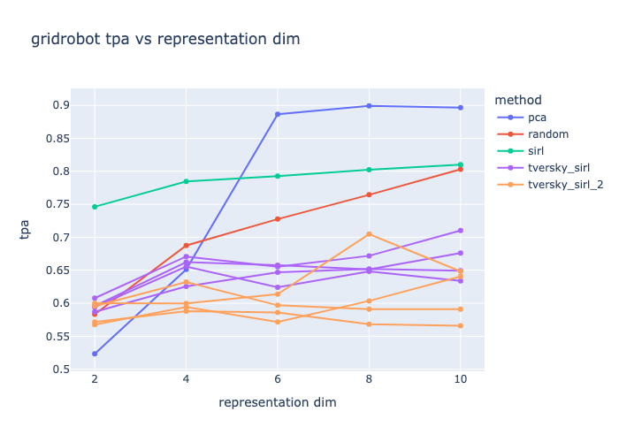

# what's all this?
this experiment uses data from `simulated_data/001-gridrobot` to evaluate FPE, TPA of:
* PCA
* random baseline (untrained SIRL)
* SIRL
* Tversky SIRL (TverskySimilarity in triplet loss, MLP left as-is)
* Tversky SIRL 2 (TverskyProjection instead of MLP, TverskySimilarity in triplet loss) - needs a better name I'm sorry

# results
## FPE

* SIRL does great, all other methods are similarly bad (including Tversky)
* improved performance seems to plateau around representation size 6 (which maybe validates why they did 6 in the SIRL paper)

## TPA

* SIRL does great again, especially at low representation size
* surprising W for PCA!
* Tversky worse than random?!