# Tversky feature report: `tversky_sirl_2_dim10_fbank4_seed0.pth` — layer: `proj`

encoder[0] Tversky projection layer: feature bank in *input* space; instances are mean-centered raw trajectories.

config: `../configs/tversky_sirl_2.yaml`  
trajectories: (1960, 19), features: (1960, 2), feature bank: (4, 19)

# sample similar + dissimilar trajectories

## query traj `1729` — features: laptop (computer_dist) = 0.0000, upright (joint_up) = 0.0000, salience = 0.0000

### 3 most similar

- traj `1211` — features: laptop (computer_dist) = 1.0000, upright (joint_up) = 0.3333, salience = 0.0000 (sim = 0.0000)

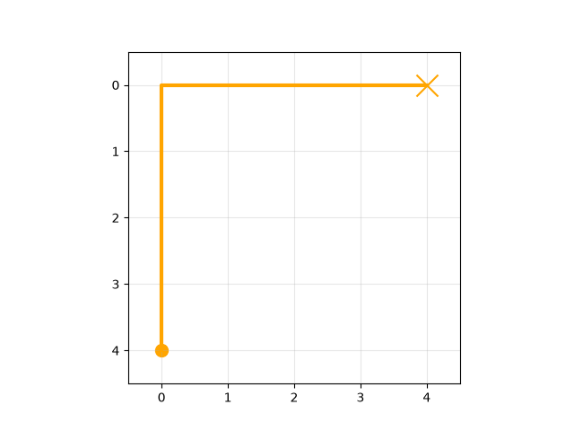

- traj `1186` — features: laptop (computer_dist) = 0.2185, upright (joint_up) = 1.0000, salience = 0.0000 (sim = 0.0000)

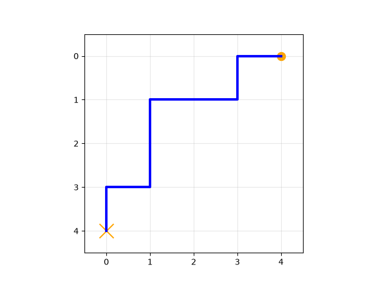

- traj `1286` — features: laptop (computer_dist) = 0.0905, upright (joint_up) = 1.0000, salience = 0.0000 (sim = 0.0000)

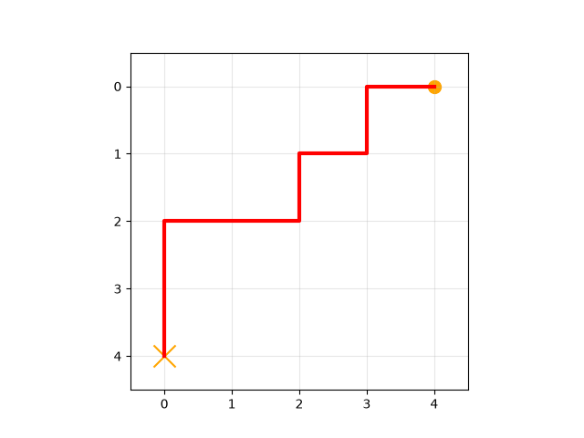

### 3 least similar

- traj `1420` — features: laptop (computer_dist) = 1.0000, upright (joint_up) = 1.0000, salience = 20.0917 (sim = -10.0458)

- traj `1612` — features: laptop (computer_dist) = 1.0000, upright (joint_up) = 0.6667, salience = 19.6876 (sim = -9.8438)

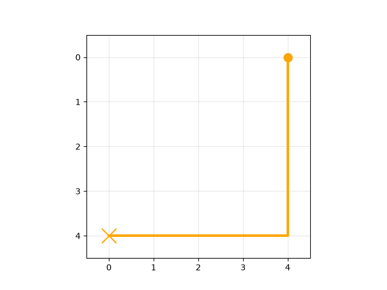

- traj `572` — features: laptop (computer_dist) = 1.0000, upright (joint_up) = 0.3333, salience = 19.2836 (sim = -9.6418)

## query traj `788` — features: laptop (computer_dist) = 0.5000, upright (joint_up) = 0.6667, salience = 2.9934

### 3 most similar

- traj `1752` — features: laptop (computer_dist) = 1.0000, upright (joint_up) = 1.0000, salience = 16.6300 (sim = 4.8321)

- traj `530` — features: laptop (computer_dist) = 0.5905, upright (joint_up) = 1.0000, salience = 11.1374 (sim = 4.6322)

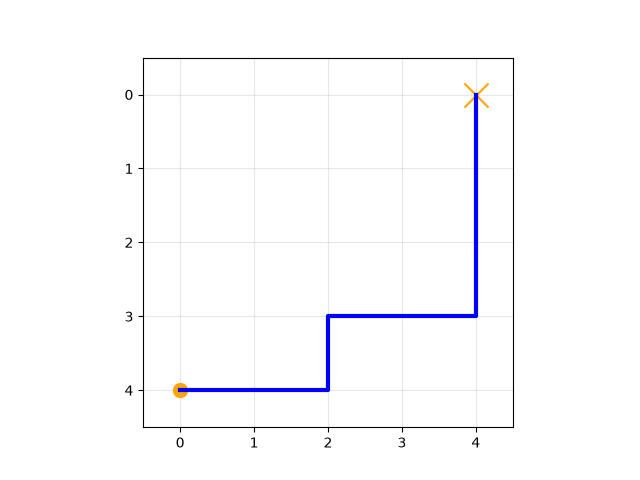

- traj `1688` — features: laptop (computer_dist) = 1.0000, upright (joint_up) = 0.6667, salience = 17.0340 (sim = 4.6315)

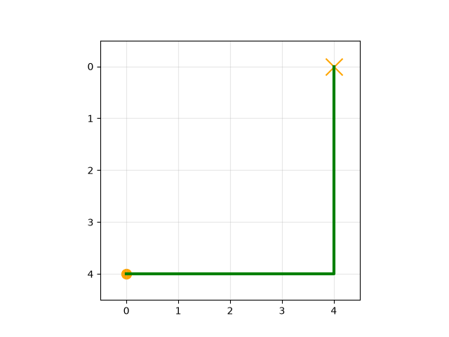

### 3 least similar

- traj `1138` — features: laptop (computer_dist) = 1.0000, upright (joint_up) = 1.0000, salience = 5.6867 (sim = -11.7313)

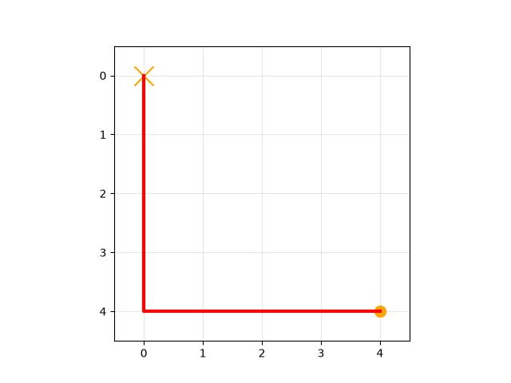

- traj `822` — features: laptop (computer_dist) = 0.5000, upright (joint_up) = 1.0000, salience = 5.4687 (sim = -11.6223)

- traj `745` — features: laptop (computer_dist) = 0.5000, upright (joint_up) = 1.0000, salience = 5.4313 (sim = -11.6037)

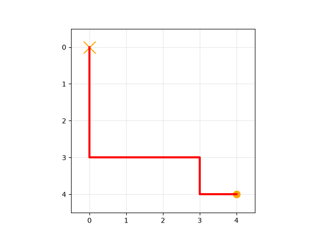

# sort trajectories by salience

10 trajectories sampled evenly from least to most salient.

## salience rank 1/10: traj `1025` — features: laptop (computer_dist) = 0.5000, upright (joint_up) = 1.0000, salience = 0.0000

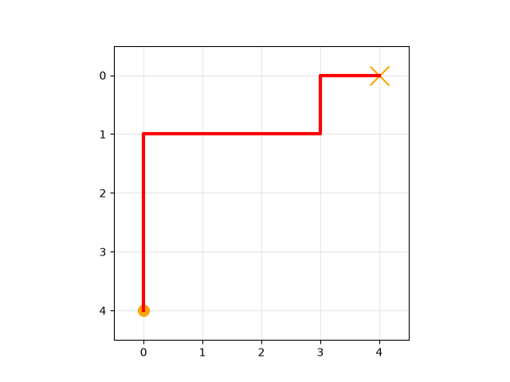

## salience rank 2/10: traj `1923` — features: laptop (computer_dist) = 0.0905, upright (joint_up) = 0.3333, salience = 0.0000

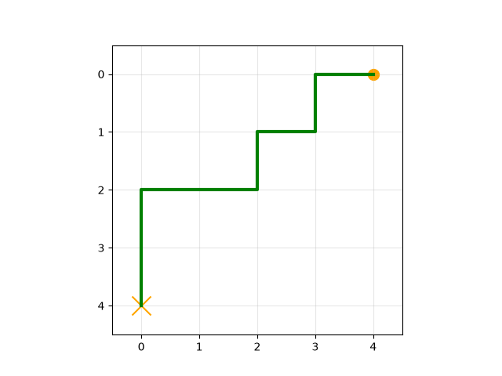

## salience rank 3/10: traj `1217` — features: laptop (computer_dist) = 0.0905, upright (joint_up) = 1.0000, salience = 0.6004

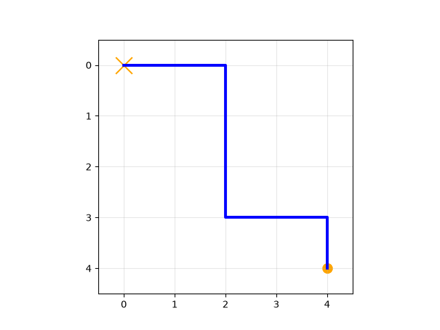

## salience rank 4/10: traj `488` — features: laptop (computer_dist) = 0.0000, upright (joint_up) = 1.0000, salience = 1.4136

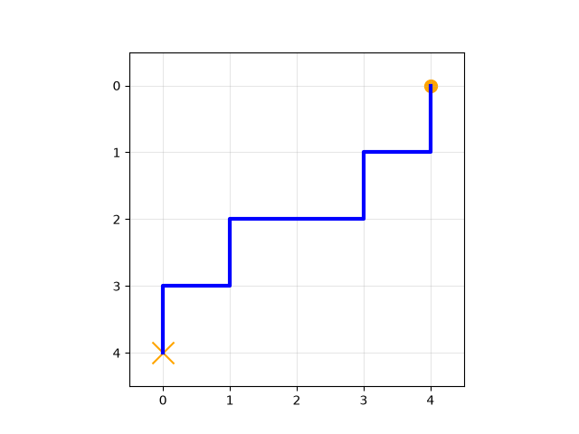

## salience rank 5/10: traj `1787` — features: laptop (computer_dist) = 0.1810, upright (joint_up) = 0.0000, salience = 1.9172

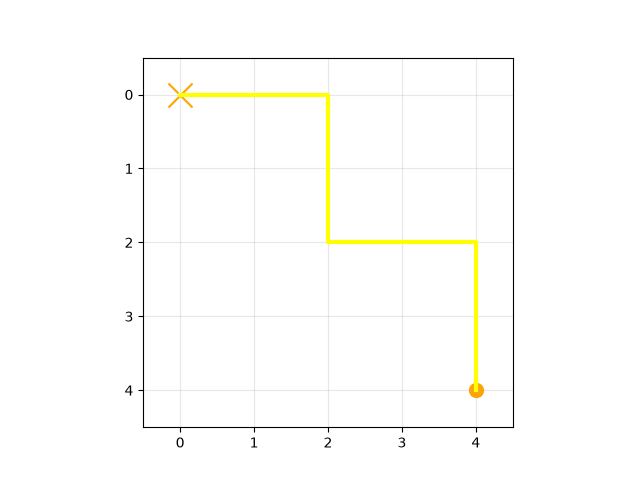

## salience rank 6/10: traj `473` — features: laptop (computer_dist) = 0.0000, upright (joint_up) = 0.6667, salience = 2.2330

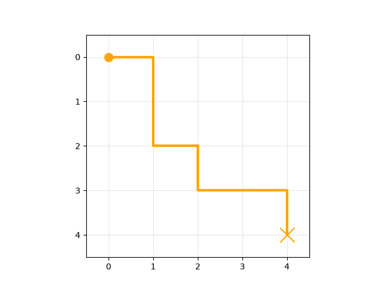

## salience rank 7/10: traj `955` — features: laptop (computer_dist) = 0.2185, upright (joint_up) = 0.3333, salience = 2.6055

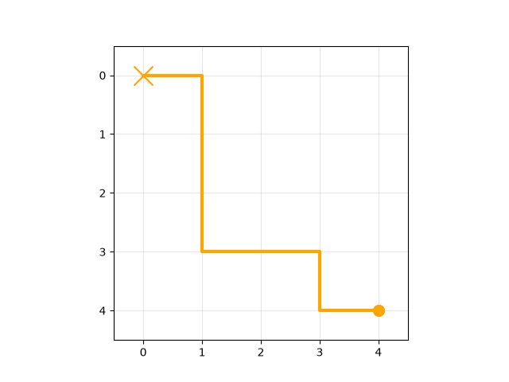

## salience rank 8/10: traj `46` — features: laptop (computer_dist) = 0.2185, upright (joint_up) = 0.3333, salience = 3.0278

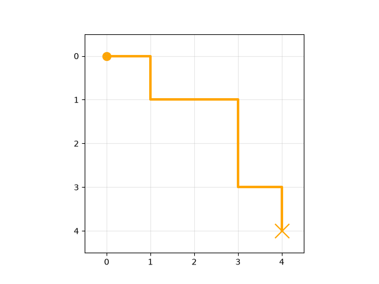

## salience rank 9/10: traj `201` — features: laptop (computer_dist) = 0.5000, upright (joint_up) = 0.3333, salience = 3.8299

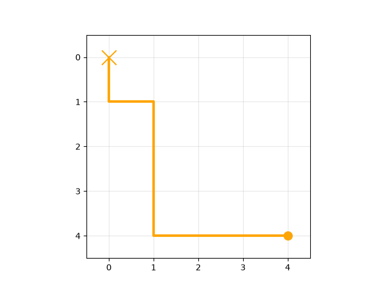

## salience rank 10/10: traj `1883` — features: laptop (computer_dist) = 0.0905, upright (joint_up) = 0.3333, salience = 6.7864

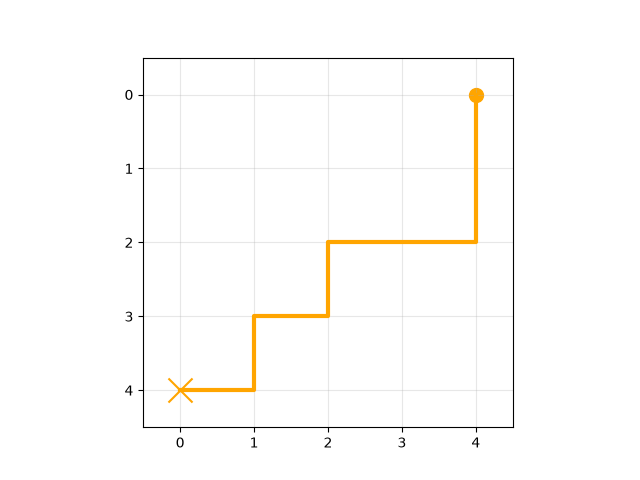

# max feature value - min feature value t-test of means

## laptop (computer_dist): max - min

expression `s(29)-s(1)` → 2 Tversky feature(s) in the difference set

**traj `29` — features: laptop (computer_dist) = 1.0000, upright (joint_up) = 0.6667, salience = 18.6500**

minus

**traj `1` — features: laptop (computer_dist) = 0.0000, upright (joint_up) = 0.3333, salience = 3.5745**

equals top instances:

- traj `128` — features: laptop (computer_dist) = 1.0000, upright (joint_up) = 1.0000, salience = 19.0540 (measure = 8.0421, salience = 8.0421)

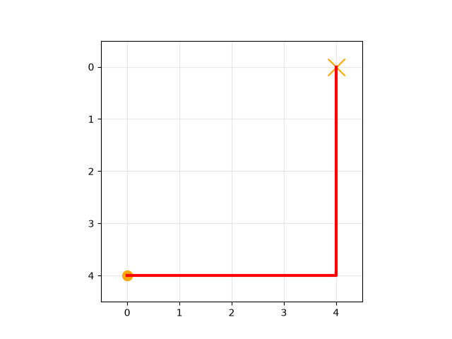

- traj `29` — features: laptop (computer_dist) = 1.0000, upright (joint_up) = 0.6667, salience = 18.6500 (measure = 8.0393, salience = 8.0393)

- traj `878` — features: laptop (computer_dist) = 1.0000, upright (joint_up) = 0.3333, salience = 18.2460 (measure = 8.0366, salience = 8.0366)

- traj `155` — features: laptop (computer_dist) = 1.0000, upright (joint_up) = 0.0000, salience = 17.8420 (measure = 8.0339, salience = 8.0339)

- traj `947` — features: laptop (computer_dist) = 1.0000, upright (joint_up) = 0.3333, salience = 17.4380 (measure = 8.0312, salience = 8.0312)

- traj `1688` — features: laptop (computer_dist) = 1.0000, upright (joint_up) = 0.6667, salience = 17.0340 (measure = 8.0284, salience = 8.0284)

- traj `1752` — features: laptop (computer_dist) = 1.0000, upright (joint_up) = 1.0000, salience = 16.6300 (measure = 8.0257, salience = 8.0257)

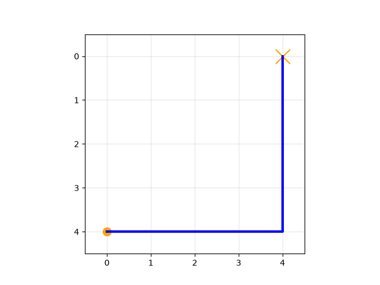

- traj `1420` — features: laptop (computer_dist) = 1.0000, upright (joint_up) = 1.0000, salience = 20.0917 (measure = 6.9881, salience = 6.9881)

- traj `1612` — features: laptop (computer_dist) = 1.0000, upright (joint_up) = 0.6667, salience = 19.6876 (measure = 6.9854, salience = 6.9854)

- traj `572` — features: laptop (computer_dist) = 1.0000, upright (joint_up) = 0.3333, salience = 19.2836 (measure = 6.9827, salience = 6.9827)

## laptop (computer_dist): min - max

expression `s(1)-s(29)` → 0 Tversky feature(s) in the difference set

**traj `1` — features: laptop (computer_dist) = 0.0000, upright (joint_up) = 0.3333, salience = 3.5745**

minus

**traj `29` — features: laptop (computer_dist) = 1.0000, upright (joint_up) = 0.6667, salience = 18.6500**

equals top instances:

*(empty feature set — no instances retrieved)*

## upright (joint_up): max - min

expression `s(2)-s(3)` → 2 Tversky feature(s) in the difference set

**traj `2` — features: laptop (computer_dist) = 0.0905, upright (joint_up) = 1.0000, salience = 3.1984**

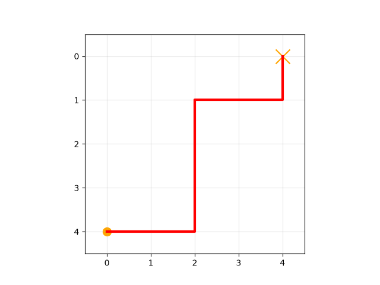

minus

**traj `3` — features: laptop (computer_dist) = 0.5000, upright (joint_up) = 0.0000, salience = 2.9879**

equals top instances:

- traj `1420` — features: laptop (computer_dist) = 1.0000, upright (joint_up) = 1.0000, salience = 20.0917 (measure = 13.1035, salience = 13.1035)

- traj `1612` — features: laptop (computer_dist) = 1.0000, upright (joint_up) = 0.6667, salience = 19.6876 (measure = 12.7023, salience = 12.7023)

- traj `572` — features: laptop (computer_dist) = 1.0000, upright (joint_up) = 0.3333, salience = 19.2836 (measure = 12.3010, salience = 12.3010)

- traj `277` — features: laptop (computer_dist) = 1.0000, upright (joint_up) = 0.0000, salience = 18.8796 (measure = 11.8997, salience = 11.8997)

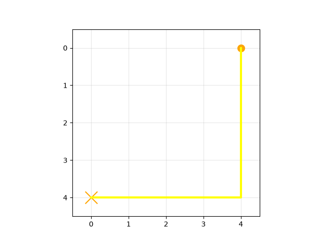

- traj `666` — features: laptop (computer_dist) = 1.0000, upright (joint_up) = 0.3333, salience = 18.4756 (measure = 11.4984, salience = 11.4984)

- traj `195` — features: laptop (computer_dist) = 0.7815, upright (joint_up) = 1.0000, salience = 16.2941 (measure = 11.2684, salience = 11.2684)

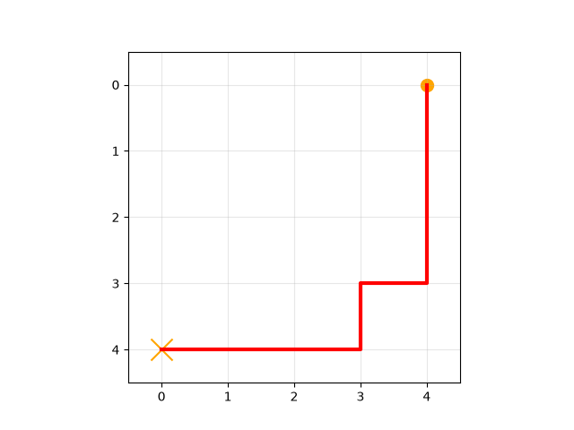

- traj `849` — features: laptop (computer_dist) = 1.0000, upright (joint_up) = 0.6667, salience = 18.0716 (measure = 11.0971, salience = 11.0971)

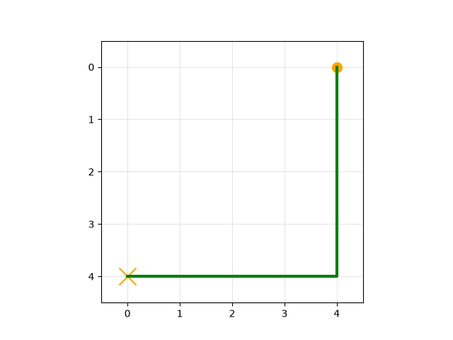

- traj `128` — features: laptop (computer_dist) = 1.0000, upright (joint_up) = 1.0000, salience = 19.0540 (measure = 11.0119, salience = 11.0119)

- traj `1671` — features: laptop (computer_dist) = 0.7815, upright (joint_up) = 0.6667, salience = 15.8901 (measure = 10.8672, salience = 10.8672)

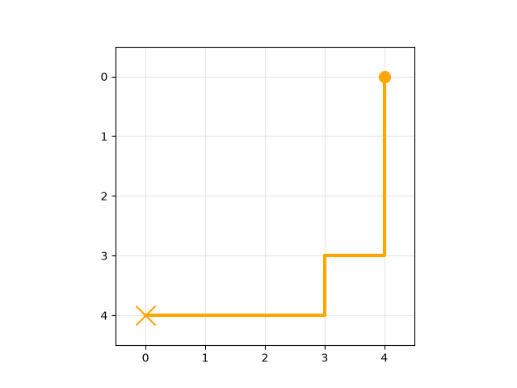

- traj `566` — features: laptop (computer_dist) = 1.0000, upright (joint_up) = 1.0000, salience = 17.6676 (measure = 10.6959, salience = 10.6959)

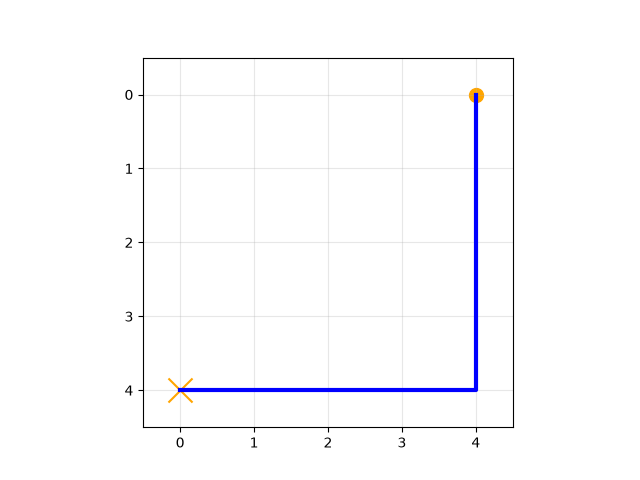

## upright (joint_up): min - max

expression `s(3)-s(2)` → 1 Tversky feature(s) in the difference set

**traj `3` — features: laptop (computer_dist) = 0.5000, upright (joint_up) = 0.0000, salience = 2.9879**

minus

**traj `2` — features: laptop (computer_dist) = 0.0905, upright (joint_up) = 1.0000, salience = 3.1984**

equals top instances:

- traj `128` — features: laptop (computer_dist) = 1.0000, upright (joint_up) = 1.0000, salience = 19.0540 (measure = 4.0059, salience = 4.0059)

- traj `29` — features: laptop (computer_dist) = 1.0000, upright (joint_up) = 0.6667, salience = 18.6500 (measure = 4.0009, salience = 4.0009)

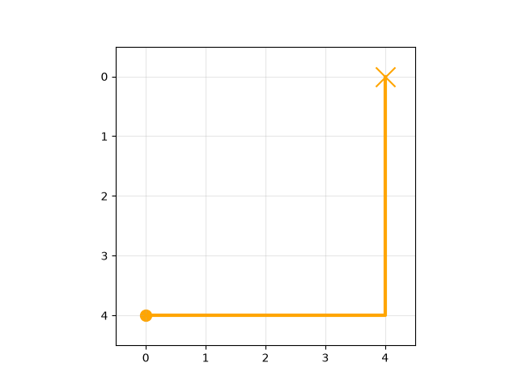

- traj `878` — features: laptop (computer_dist) = 1.0000, upright (joint_up) = 0.3333, salience = 18.2460 (measure = 3.9958, salience = 3.9958)

- traj `155` — features: laptop (computer_dist) = 1.0000, upright (joint_up) = 0.0000, salience = 17.8420 (measure = 3.9908, salience = 3.9908)

- traj `947` — features: laptop (computer_dist) = 1.0000, upright (joint_up) = 0.3333, salience = 17.4380 (measure = 3.9858, salience = 3.9858)

- traj `1688` — features: laptop (computer_dist) = 1.0000, upright (joint_up) = 0.6667, salience = 17.0340 (measure = 3.9807, salience = 3.9807)

- traj `1752` — features: laptop (computer_dist) = 1.0000, upright (joint_up) = 1.0000, salience = 16.6300 (measure = 3.9757, salience = 3.9757)

- traj `1420` — features: laptop (computer_dist) = 1.0000, upright (joint_up) = 1.0000, salience = 20.0917 (measure = 3.7816, salience = 3.7816)

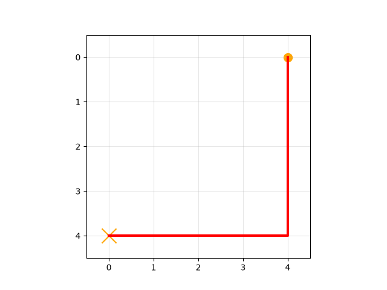

- traj `1612` — features: laptop (computer_dist) = 1.0000, upright (joint_up) = 0.6667, salience = 19.6876 (measure = 3.7766, salience = 3.7766)

- traj `572` — features: laptop (computer_dist) = 1.0000, upright (joint_up) = 0.3333, salience = 19.2836 (measure = 3.7715, salience = 3.7715)

## t-test of means

- **laptop (computer_dist)**: skipped — at least one feature set is empty (max-min: 10 instances, min-max: 0 instances)

- **upright (joint_up)**: mean(max-min set) = 0.6667, mean(min-max set) = 0.6000, t = 0.4286, p = 0.6733

