# Tversky feature report: `tversky_sirl_2_dim10_fbank4_seed0.pth` — layer: `sim`

final `TverskySimilarity` head: feature bank in *embedding* space; instances are mean-centered model embeddings.

config: `../configs/tversky_sirl_2.yaml`  
trajectories: (1960, 19), features: (1960, 2), feature bank: (4, 10)

# sample similar + dissimilar trajectories

## query traj `1729` — features: laptop (computer_dist) = 0.0000, upright (joint_up) = 0.0000, salience = 2.7589

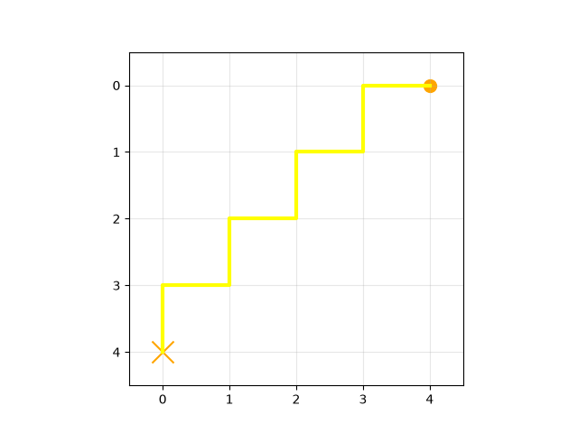

### 3 most similar

- traj `1236` — features: laptop (computer_dist) = 0.0905, upright (joint_up) = 1.0000, salience = 2.7331 (sim = 2.1025)

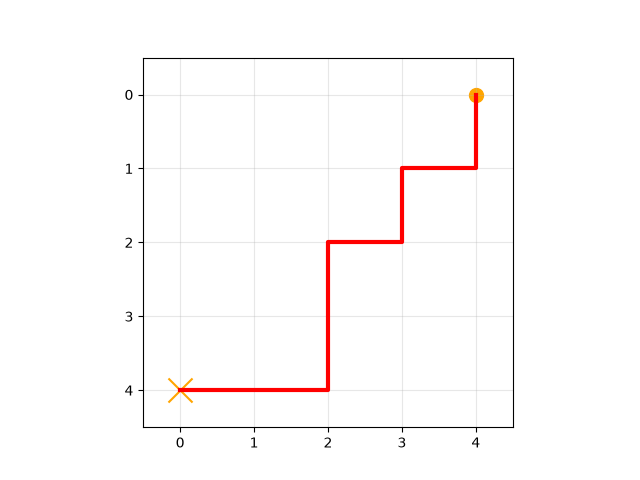

- traj `159` — features: laptop (computer_dist) = 0.0000, upright (joint_up) = 0.3333, salience = 2.7295 (sim = 2.0965)

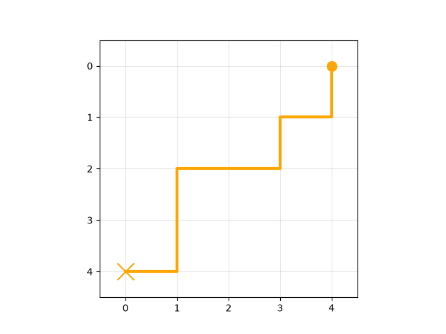

- traj `863` — features: laptop (computer_dist) = 0.0000, upright (joint_up) = 0.6667, salience = 2.6694 (sim = 2.0676)

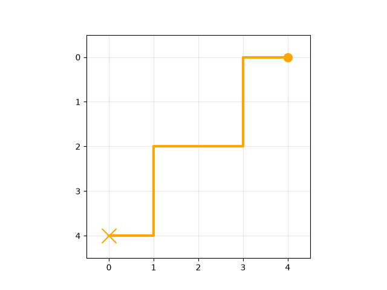

### 3 least similar

- traj `829` — features: laptop (computer_dist) = 0.0905, upright (joint_up) = 1.0000, salience = 11.0104 (sim = -4.6777)

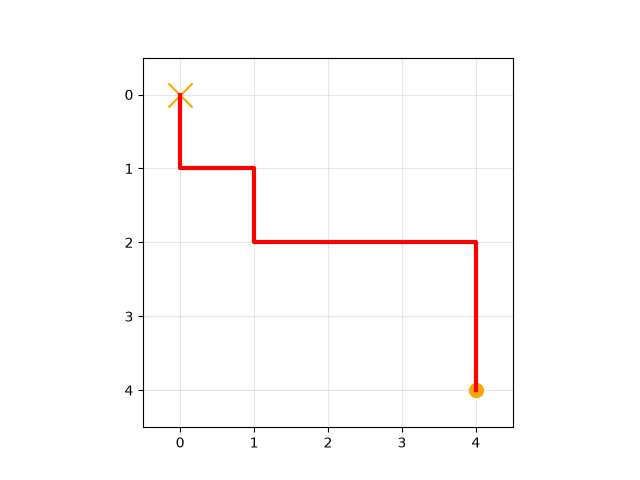

- traj `822` — features: laptop (computer_dist) = 0.5000, upright (joint_up) = 1.0000, salience = 11.2342 (sim = -4.6291)

- traj `1299` — features: laptop (computer_dist) = 0.0905, upright (joint_up) = 0.6667, salience = 10.7859 (sim = -4.5044)

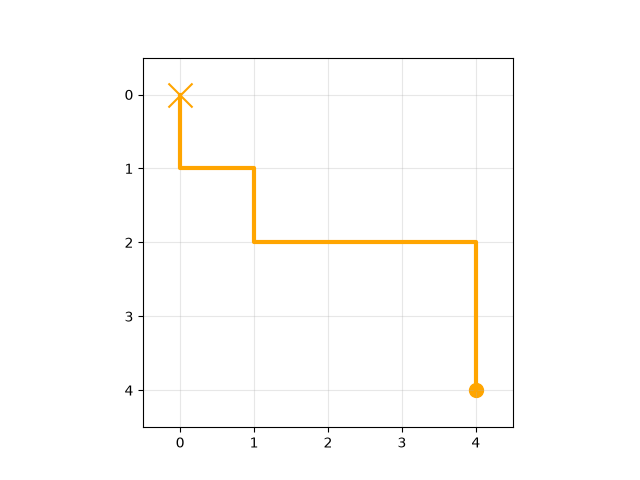

## query traj `788` — features: laptop (computer_dist) = 0.5000, upright (joint_up) = 0.6667, salience = 0.0556

### 3 most similar

- traj `0` — features: laptop (computer_dist) = 0.2185, upright (joint_up) = 0.6667, salience = 0.0000 (sim = 0.0317)

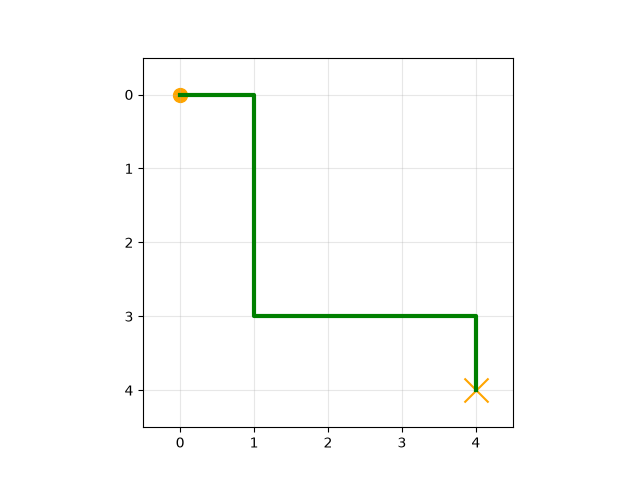

- traj `1530` — features: laptop (computer_dist) = 0.0905, upright (joint_up) = 1.0000, salience = 0.0000 (sim = 0.0317)

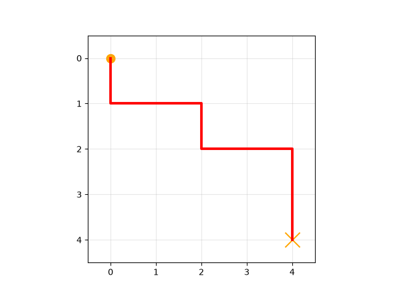

- traj `1538` — features: laptop (computer_dist) = 0.0905, upright (joint_up) = 1.0000, salience = 0.0000 (sim = 0.0317)

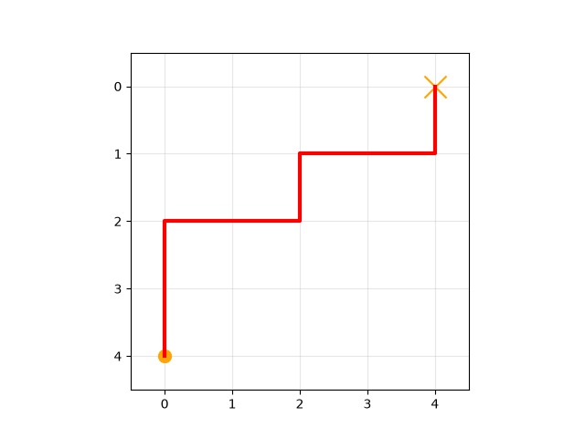

### 3 least similar

- traj `822` — features: laptop (computer_dist) = 0.5000, upright (joint_up) = 1.0000, salience = 11.2342 (sim = -16.6782)

- traj `1597` — features: laptop (computer_dist) = 0.5000, upright (joint_up) = 0.6667, salience = 11.0097 (sim = -16.3434)

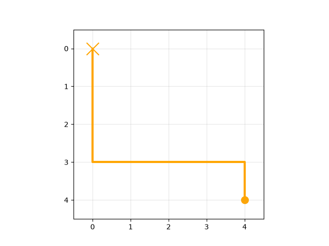

- traj `829` — features: laptop (computer_dist) = 0.0905, upright (joint_up) = 1.0000, salience = 11.0104 (sim = -16.3343)

# sort trajectories by salience

10 trajectories sampled evenly from least to most salient.

## salience rank 1/10: traj `264` — features: laptop (computer_dist) = 0.0000, upright (joint_up) = 1.0000, salience = 0.0000

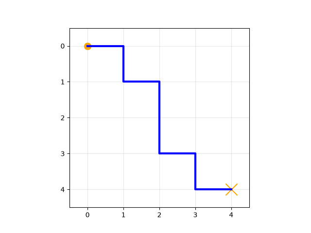

## salience rank 2/10: traj `1779` — features: laptop (computer_dist) = 0.2185, upright (joint_up) = 1.0000, salience = 0.0000

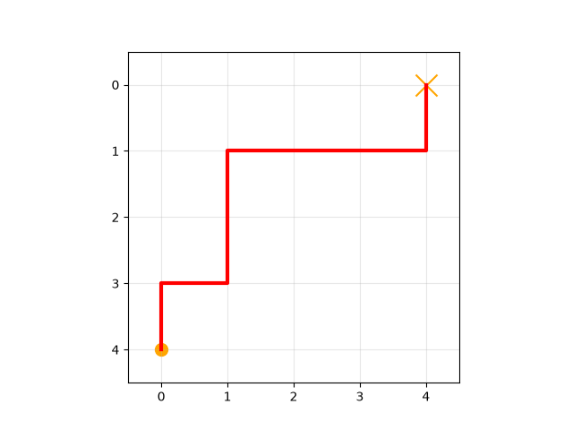

## salience rank 3/10: traj `1748` — features: laptop (computer_dist) = 0.0905, upright (joint_up) = 1.0000, salience = 0.0000

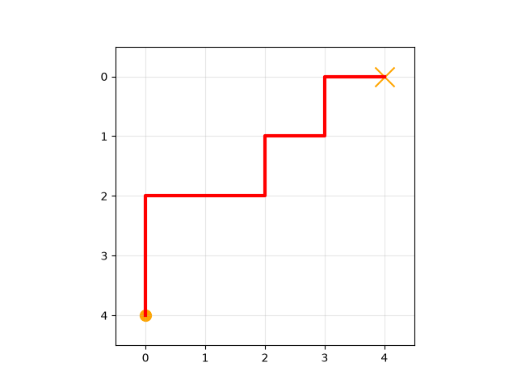

## salience rank 4/10: traj `1800` — features: laptop (computer_dist) = 0.1810, upright (joint_up) = 0.6667, salience = 0.1099

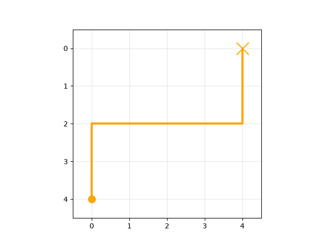

## salience rank 5/10: traj `22` — features: laptop (computer_dist) = 0.5000, upright (joint_up) = 1.0000, salience = 0.2637

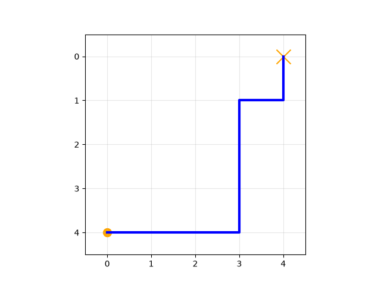

## salience rank 6/10: traj `1241` — features: laptop (computer_dist) = 0.5000, upright (joint_up) = 0.6667, salience = 0.6724

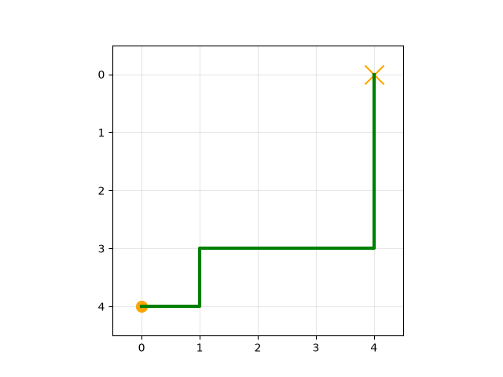

## salience rank 7/10: traj `1957` — features: laptop (computer_dist) = 0.0000, upright (joint_up) = 0.0000, salience = 2.0842

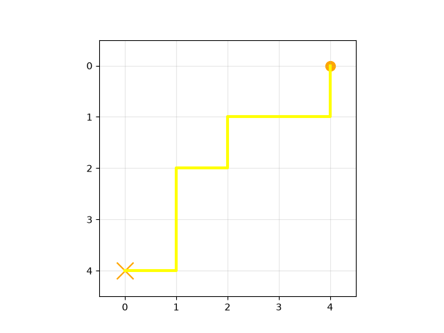

## salience rank 8/10: traj `383` — features: laptop (computer_dist) = 0.0000, upright (joint_up) = 1.0000, salience = 3.7725

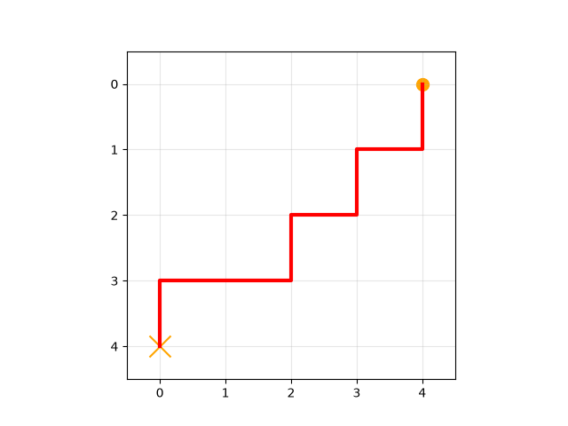

## salience rank 9/10: traj `683` — features: laptop (computer_dist) = 0.5905, upright (joint_up) = 1.0000, salience = 5.8824

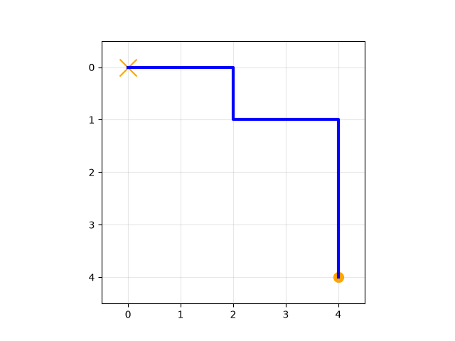

## salience rank 10/10: traj `1919` — features: laptop (computer_dist) = 0.0905, upright (joint_up) = 1.0000, salience = 7.8194

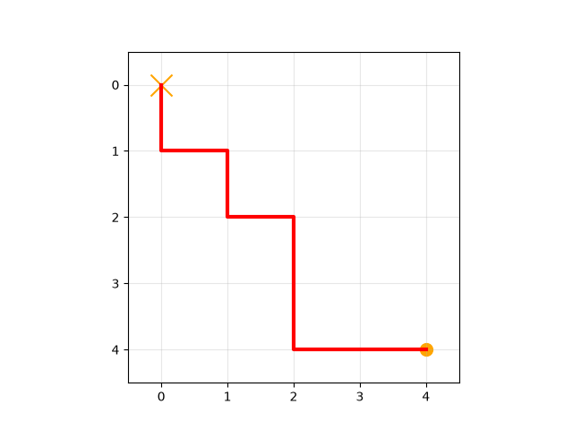

# max feature value - min feature value t-test of means

## laptop (computer_dist): max - min

expression `s(29)-s(1)` → 0 Tversky feature(s) in the difference set

**traj `29` — features: laptop (computer_dist) = 1.0000, upright (joint_up) = 0.6667, salience = 0.8474**

minus

**traj `1` — features: laptop (computer_dist) = 0.0000, upright (joint_up) = 0.3333, salience = 8.9286**

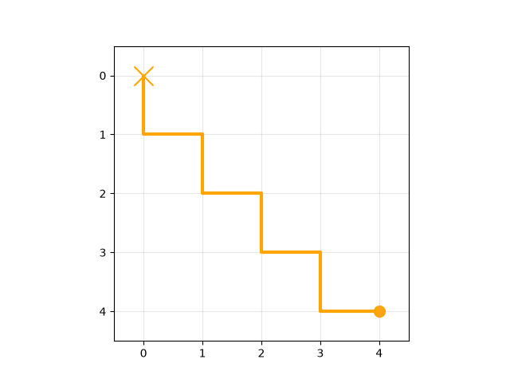

equals top instances:

*(empty feature set — no instances retrieved)*

## laptop (computer_dist): min - max

expression `s(1)-s(29)` → 3 Tversky feature(s) in the difference set

**traj `1` — features: laptop (computer_dist) = 0.0000, upright (joint_up) = 0.3333, salience = 8.9286**

minus

**traj `29` — features: laptop (computer_dist) = 1.0000, upright (joint_up) = 0.6667, salience = 0.8474**

equals top instances:

- traj `822` — features: laptop (computer_dist) = 0.5000, upright (joint_up) = 1.0000, salience = 11.2342 (measure = 10.9852, salience = 10.9852)

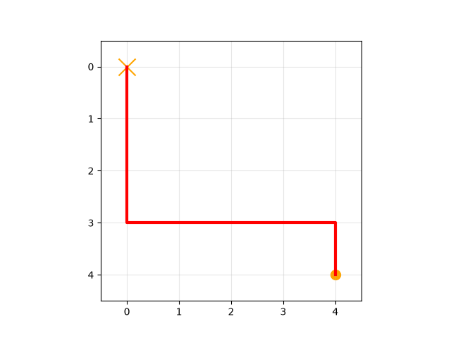

- traj `1597` — features: laptop (computer_dist) = 0.5000, upright (joint_up) = 0.6667, salience = 11.0097 (measure = 10.7669, salience = 10.7669)

- traj `1463` — features: laptop (computer_dist) = 0.2185, upright (joint_up) = 1.0000, salience = 10.9628 (measure = 10.6934, salience = 10.6934)

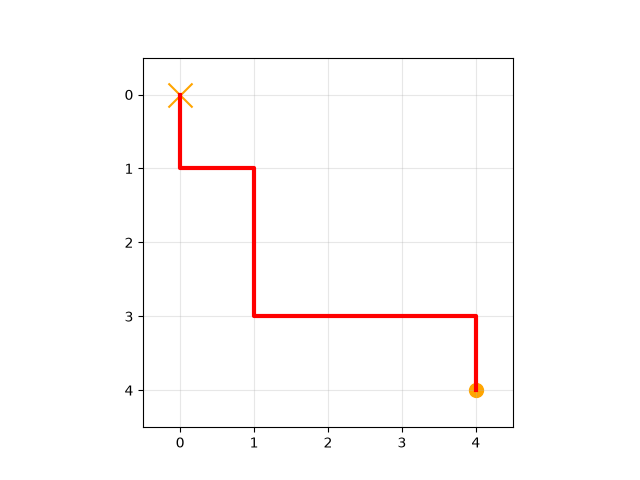

- traj `1027` — features: laptop (computer_dist) = 0.5000, upright (joint_up) = 0.3333, salience = 10.7852 (measure = 10.5487, salience = 10.5487)

- traj `829` — features: laptop (computer_dist) = 0.0905, upright (joint_up) = 1.0000, salience = 11.0104 (measure = 10.5276, salience = 10.5276)

- traj `255` — features: laptop (computer_dist) = 0.0000, upright (joint_up) = 1.0000, salience = 10.8839 (measure = 10.5170, salience = 10.5170)

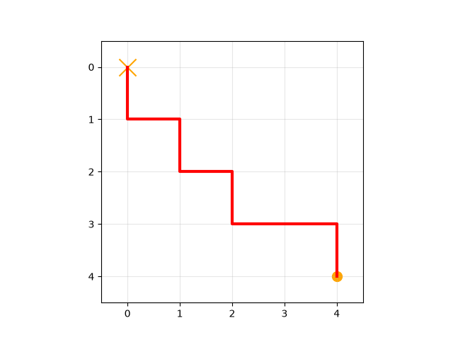

- traj `1924` — features: laptop (computer_dist) = 0.2185, upright (joint_up) = 0.6667, salience = 10.7383 (measure = 10.4752, salience = 10.4752)

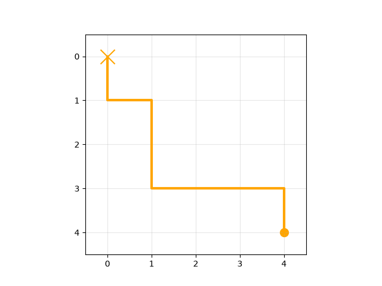

- traj `793` — features: laptop (computer_dist) = 0.5000, upright (joint_up) = 0.0000, salience = 10.5607 (measure = 10.3305, salience = 10.3305)

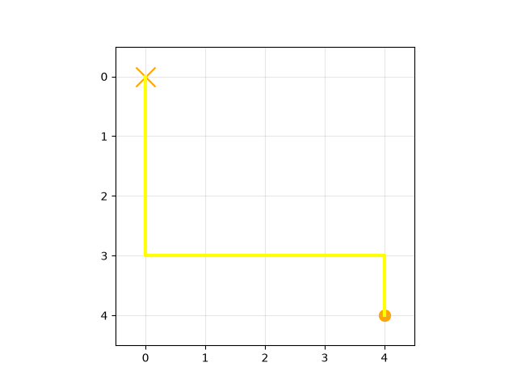

- traj `1299` — features: laptop (computer_dist) = 0.0905, upright (joint_up) = 0.6667, salience = 10.7859 (measure = 10.3094, salience = 10.3094)

- traj `1282` — features: laptop (computer_dist) = 0.0000, upright (joint_up) = 0.6667, salience = 10.6594 (measure = 10.2988, salience = 10.2988)

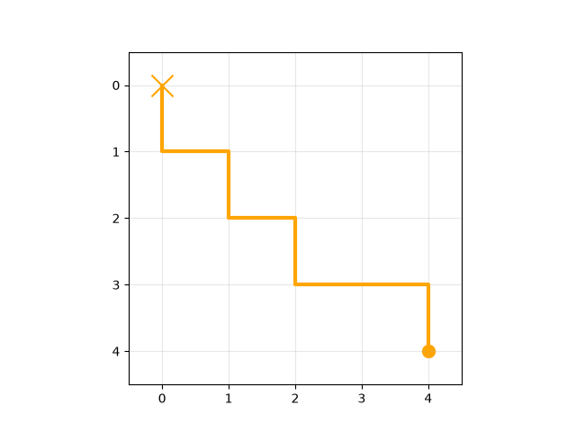

## upright (joint_up): max - min

expression `s(2)-s(3)` → 0 Tversky feature(s) in the difference set

**traj `2` — features: laptop (computer_dist) = 0.0905, upright (joint_up) = 1.0000, salience = 0.0000**

minus

**traj `3` — features: laptop (computer_dist) = 0.5000, upright (joint_up) = 0.0000, salience = 0.0431**

equals top instances:

*(empty feature set — no instances retrieved)*

## upright (joint_up): min - max

expression `s(3)-s(2)` → 1 Tversky feature(s) in the difference set

**traj `3` — features: laptop (computer_dist) = 0.5000, upright (joint_up) = 0.0000, salience = 0.0431**

minus

**traj `2` — features: laptop (computer_dist) = 0.0905, upright (joint_up) = 1.0000, salience = 0.0000**

equals top instances:

- traj `128` — features: laptop (computer_dist) = 1.0000, upright (joint_up) = 1.0000, salience = 0.8536 (measure = 0.8536, salience = 0.8536)

- traj `29` — features: laptop (computer_dist) = 1.0000, upright (joint_up) = 0.6667, salience = 0.8474 (measure = 0.8474, salience = 0.8474)

- traj `878` — features: laptop (computer_dist) = 1.0000, upright (joint_up) = 0.3333, salience = 0.8411 (measure = 0.8411, salience = 0.8411)

- traj `155` — features: laptop (computer_dist) = 1.0000, upright (joint_up) = 0.0000, salience = 0.8349 (measure = 0.8349, salience = 0.8349)

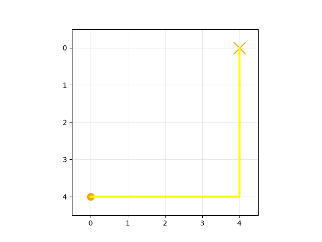

- traj `947` — features: laptop (computer_dist) = 1.0000, upright (joint_up) = 0.3333, salience = 0.8287 (measure = 0.8287, salience = 0.8287)

- traj `1688` — features: laptop (computer_dist) = 1.0000, upright (joint_up) = 0.6667, salience = 0.8224 (measure = 0.8224, salience = 0.8224)

- traj `1752` — features: laptop (computer_dist) = 1.0000, upright (joint_up) = 1.0000, salience = 0.8162 (measure = 0.8162, salience = 0.8162)

- traj `1420` — features: laptop (computer_dist) = 1.0000, upright (joint_up) = 1.0000, salience = 0.9344 (measure = 0.7854, salience = 0.7854)

- traj `1612` — features: laptop (computer_dist) = 1.0000, upright (joint_up) = 0.6667, salience = 0.8295 (measure = 0.7792, salience = 0.7792)

- traj `572` — features: laptop (computer_dist) = 1.0000, upright (joint_up) = 0.3333, salience = 0.7729 (measure = 0.7729, salience = 0.7729)

## t-test of means

- **laptop (computer_dist)**: skipped — at least one feature set is empty (max-min: 0 instances, min-max: 10 instances)

- **upright (joint_up)**: skipped — at least one feature set is empty (max-min: 0 instances, min-max: 10 instances)

*Can't run any t-tests on this model — the feature sets are empty.*

