# Tversky feature report: `tversky_sirl_dim10_fbank4_seed0.pth`

config: `../configs/tversky_sirl.yaml`  
trajectories: (1960, 19), features: (1960, 2), feature bank: (4, 10)

# sample similar + dissimilar trajectories

## query traj `1729` — features: laptop (computer_dist) = 0.0000, upright (joint_up) = 0.0000, salience = 0.0645

### 3 most similar

- traj `1583` — features: laptop (computer_dist) = 0.0000, upright (joint_up) = 0.3333, salience = 0.0630 (sim = 0.0033)

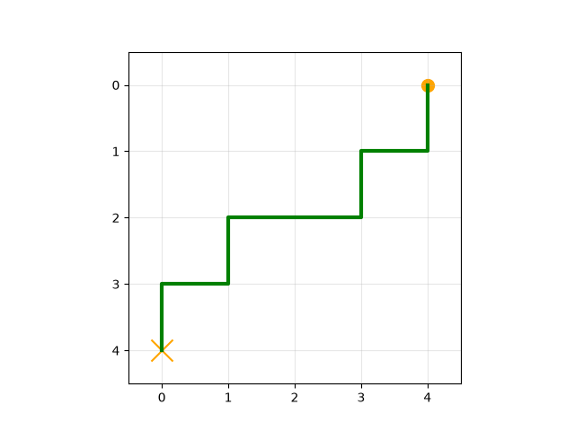

- traj `1463` — features: laptop (computer_dist) = 0.2185, upright (joint_up) = 1.0000, salience = 0.0668 (sim = 0.0031)

- traj `1658` — features: laptop (computer_dist) = 0.0000, upright (joint_up) = 1.0000, salience = 0.0675 (sim = 0.0028)

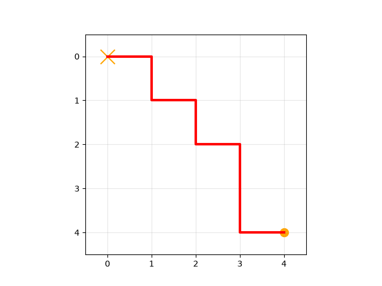

### 3 least similar

- traj `216` — features: laptop (computer_dist) = 0.5905, upright (joint_up) = 1.0000, salience = 8.1493 (sim = -3.7186)

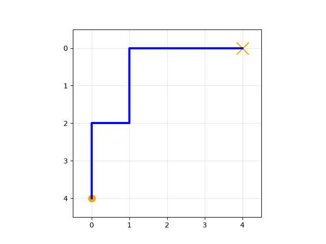

- traj `1827` — features: laptop (computer_dist) = 1.0000, upright (joint_up) = 1.0000, salience = 8.0475 (sim = -3.6750)

- traj `1533` — features: laptop (computer_dist) = 0.5905, upright (joint_up) = 0.6667, salience = 8.0387 (sim = -3.6678)

## query traj `788` — features: laptop (computer_dist) = 0.5000, upright (joint_up) = 0.6667, salience = 0.0000

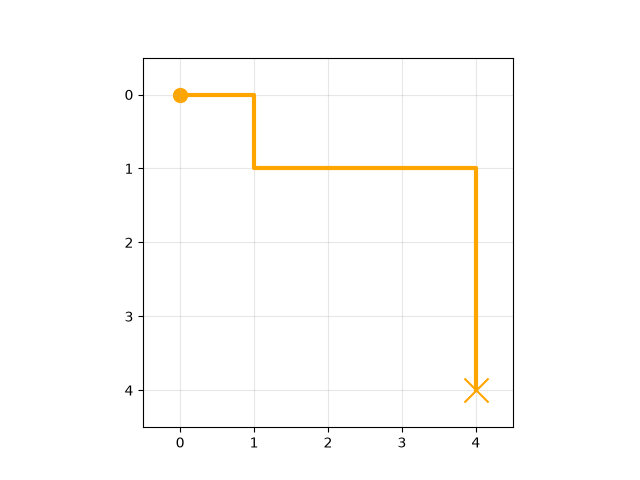

### 3 most similar

- traj `874` — features: laptop (computer_dist) = 0.2185, upright (joint_up) = 1.0000, salience = 0.0000 (sim = 0.0000)

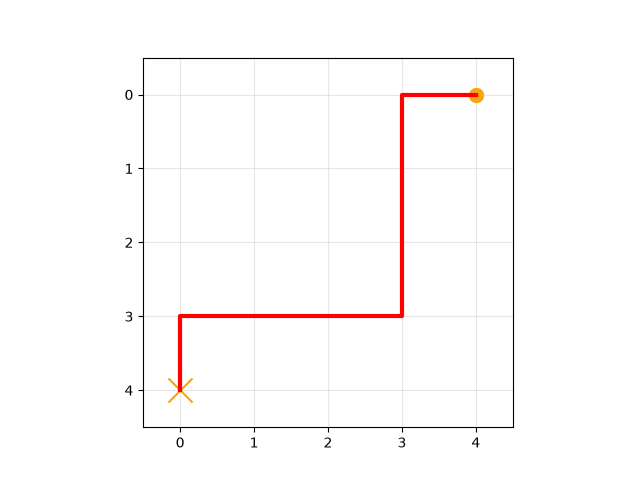

- traj `360` — features: laptop (computer_dist) = 0.0905, upright (joint_up) = 0.3333, salience = 0.0000 (sim = 0.0000)

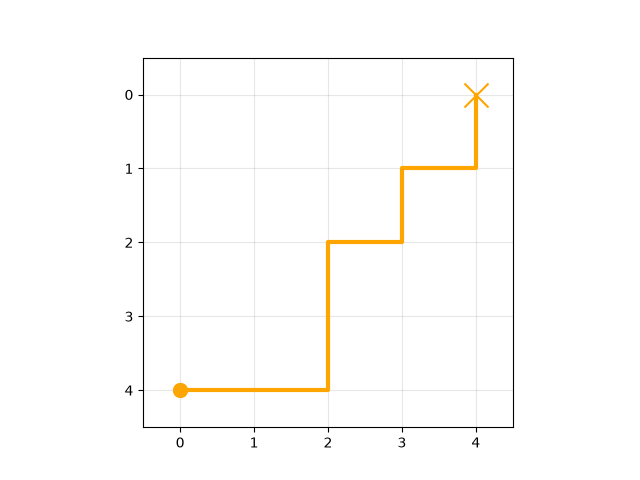

- traj `1516` — features: laptop (computer_dist) = 0.5000, upright (joint_up) = 1.0000, salience = 0.0000 (sim = 0.0000)

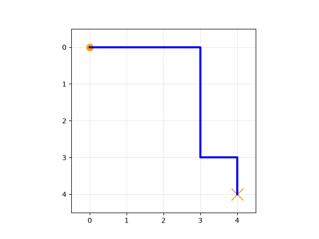

### 3 least similar

- traj `216` — features: laptop (computer_dist) = 0.5905, upright (joint_up) = 1.0000, salience = 8.1493 (sim = -3.8789)

- traj `1827` — features: laptop (computer_dist) = 1.0000, upright (joint_up) = 1.0000, salience = 8.0475 (sim = -3.8305)

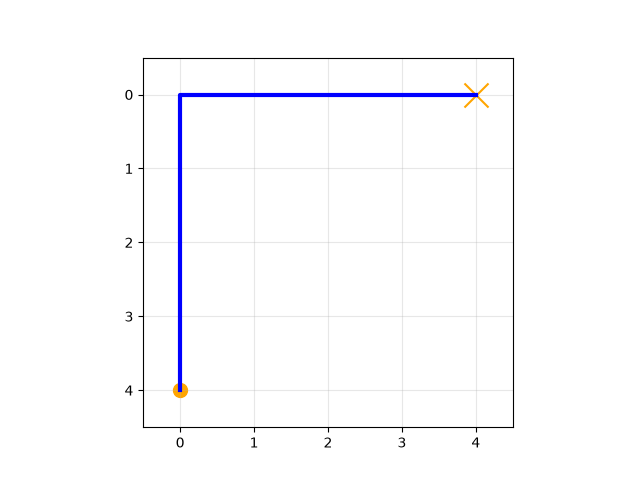

- traj `1533` — features: laptop (computer_dist) = 0.5905, upright (joint_up) = 0.6667, salience = 8.0387 (sim = -3.8263)

# sort trajectories by salience

10 trajectories sampled evenly from least to most salient.

## salience rank 1/10: traj `638` — features: laptop (computer_dist) = 0.3995, upright (joint_up) = 1.0000, salience = 0.0000

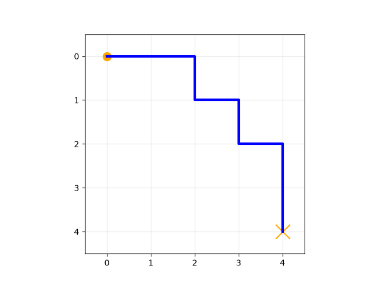

## salience rank 2/10: traj `1314` — features: laptop (computer_dist) = 0.3995, upright (joint_up) = 1.0000, salience = 0.0000

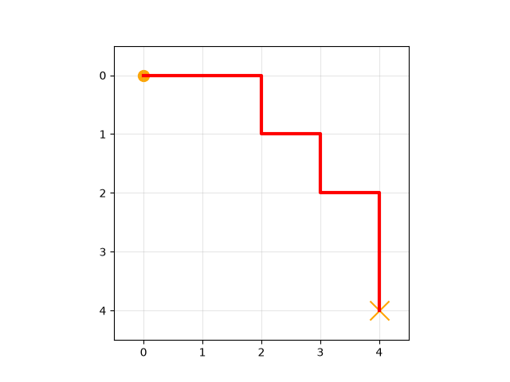

## salience rank 3/10: traj `1505` — features: laptop (computer_dist) = 0.0000, upright (joint_up) = 1.0000, salience = 0.0000

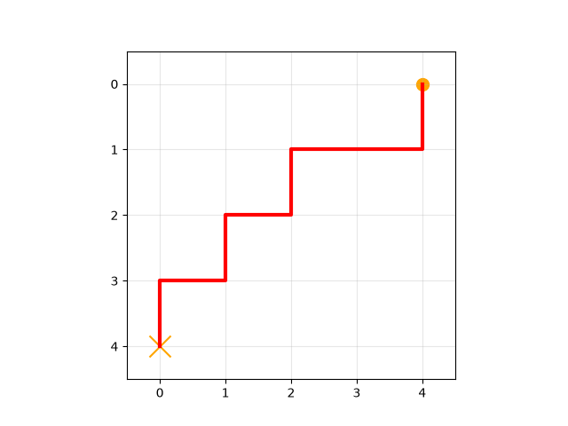

## salience rank 4/10: traj `1787` — features: laptop (computer_dist) = 0.1810, upright (joint_up) = 0.0000, salience = 0.0565

## salience rank 5/10: traj `1736` — features: laptop (computer_dist) = 0.0905, upright (joint_up) = 0.3333, salience = 0.1900

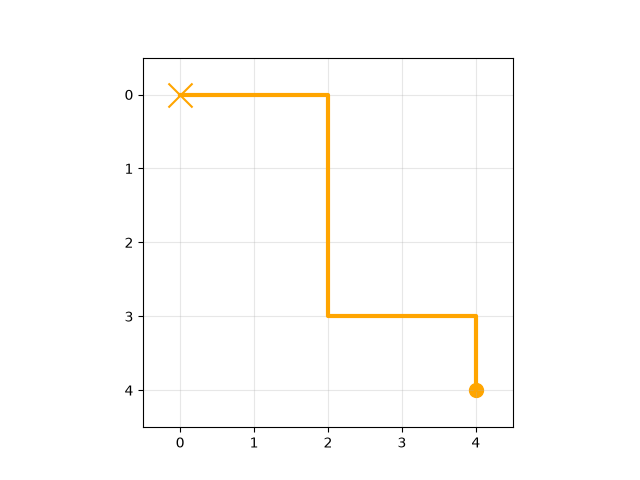

## salience rank 6/10: traj `1677` — features: laptop (computer_dist) = 0.0000, upright (joint_up) = 0.0000, salience = 0.3303

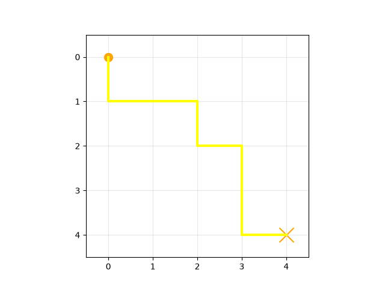

## salience rank 7/10: traj `696` — features: laptop (computer_dist) = 0.0905, upright (joint_up) = 1.0000, salience = 0.5168

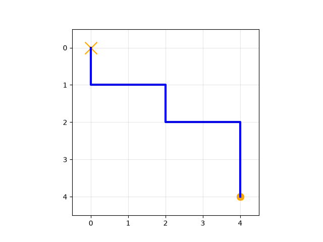

## salience rank 8/10: traj `237` — features: laptop (computer_dist) = 0.2185, upright (joint_up) = 1.0000, salience = 0.7409

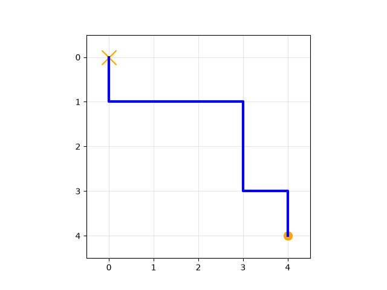

## salience rank 9/10: traj `538` — features: laptop (computer_dist) = 0.3090, upright (joint_up) = 0.3333, salience = 1.4325

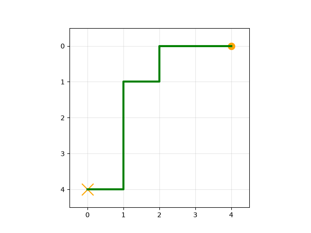

## salience rank 10/10: traj `1235` — features: laptop (computer_dist) = 0.0000, upright (joint_up) = 0.3333, salience = 3.4634

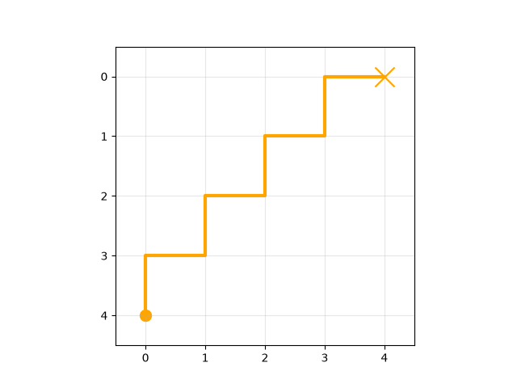

# max feature value - min feature value t-test of means

## laptop (computer_dist): max - min

expression `s(29)-s(1)` → 0 Tversky feature(s) in the difference set

**traj `29` — features: laptop (computer_dist) = 1.0000, upright (joint_up) = 0.6667, salience = 0.0000**

minus

**traj `1` — features: laptop (computer_dist) = 0.0000, upright (joint_up) = 0.3333, salience = 0.2521**

equals top instances:

*(empty feature set — no instances retrieved)*

## laptop (computer_dist): min - max

expression `s(1)-s(29)` → 1 Tversky feature(s) in the difference set

**traj `1` — features: laptop (computer_dist) = 0.0000, upright (joint_up) = 0.3333, salience = 0.2521**

minus

**traj `29` — features: laptop (computer_dist) = 1.0000, upright (joint_up) = 0.6667, salience = 0.0000**

equals top instances:

- traj `216` — features: laptop (computer_dist) = 0.5905, upright (joint_up) = 1.0000, salience = 8.1493 (measure = 2.0606, salience = 2.0606)

- traj `1533` — features: laptop (computer_dist) = 0.5905, upright (joint_up) = 0.6667, salience = 8.0387 (measure = 2.0319, salience = 2.0319)

- traj `778` — features: laptop (computer_dist) = 0.5905, upright (joint_up) = 0.3333, salience = 7.8414 (measure = 1.9838, salience = 1.9838)

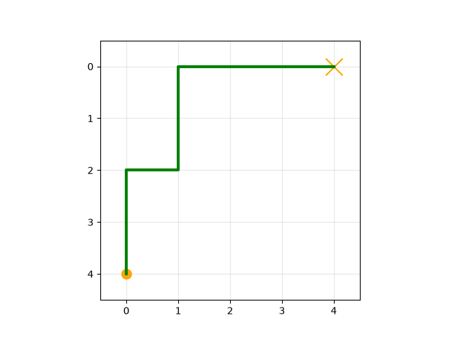

- traj `1827` — features: laptop (computer_dist) = 1.0000, upright (joint_up) = 1.0000, salience = 8.0475 (measure = 1.9833, salience = 1.9833)

- traj `1382` — features: laptop (computer_dist) = 1.0000, upright (joint_up) = 0.6667, salience = 7.9834 (measure = 1.9661, salience = 1.9661)

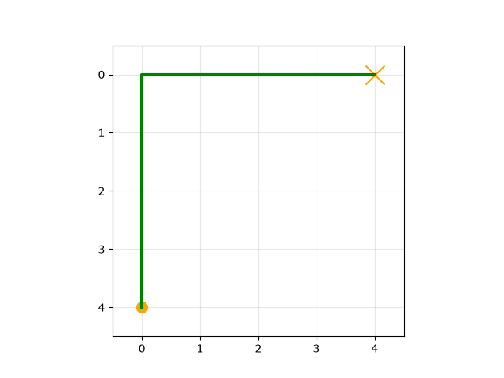

- traj `340` — features: laptop (computer_dist) = 1.0000, upright (joint_up) = 0.3333, salience = 7.8496 (measure = 1.9307, salience = 1.9307)

- traj `1284` — features: laptop (computer_dist) = 0.5905, upright (joint_up) = 0.0000, salience = 7.5475 (measure = 1.9133, salience = 1.9133)

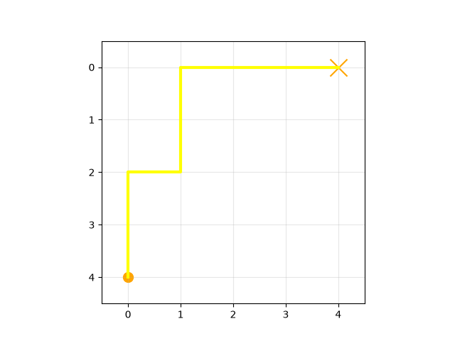

- traj `439` — features: laptop (computer_dist) = 0.3995, upright (joint_up) = 1.0000, salience = 7.5185 (measure = 1.8880, salience = 1.8880)

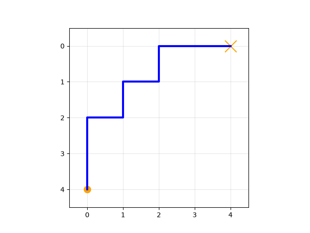

- traj `1944` — features: laptop (computer_dist) = 1.0000, upright (joint_up) = 0.0000, salience = 7.6715 (measure = 1.8857, salience = 1.8857)

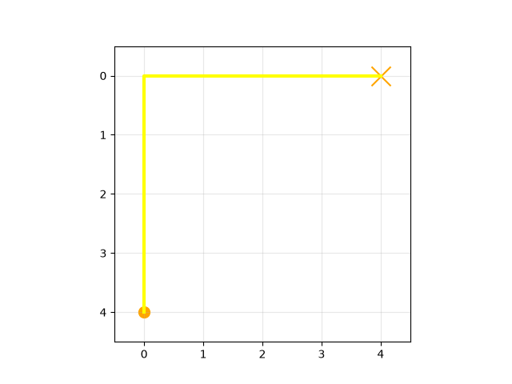

- traj `948` — features: laptop (computer_dist) = 0.7815, upright (joint_up) = 1.0000, salience = 7.6484 (measure = 1.8729, salience = 1.8729)

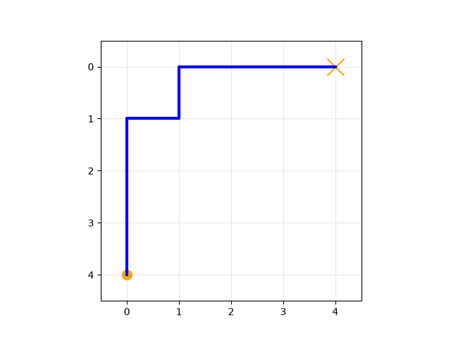

## upright (joint_up): max - min

expression `s(2)-s(3)` → 0 Tversky feature(s) in the difference set

**traj `2` — features: laptop (computer_dist) = 0.0905, upright (joint_up) = 1.0000, salience = 0.0000**

minus

**traj `3` — features: laptop (computer_dist) = 0.5000, upright (joint_up) = 0.0000, salience = 0.0000**

equals top instances:

*(empty feature set — no instances retrieved)*

## upright (joint_up): min - max

expression `s(3)-s(2)` → 0 Tversky feature(s) in the difference set

**traj `3` — features: laptop (computer_dist) = 0.5000, upright (joint_up) = 0.0000, salience = 0.0000**

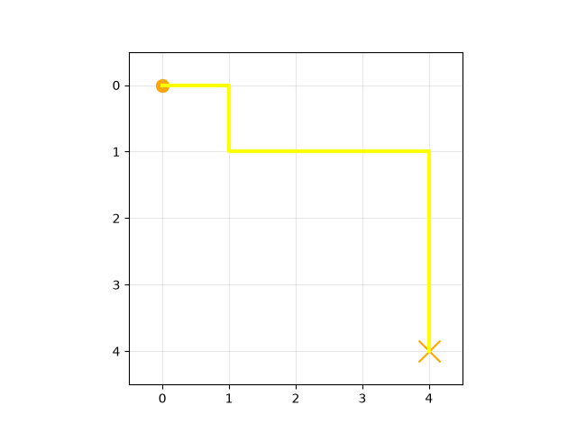

minus

**traj `2` — features: laptop (computer_dist) = 0.0905, upright (joint_up) = 1.0000, salience = 0.0000**

equals top instances:

*(empty feature set — no instances retrieved)*

## t-test of means

- **laptop (computer_dist)**: skipped — at least one feature set is empty (max-min: 0 instances, min-max: 10 instances)

- **upright (joint_up)**: skipped — at least one feature set is empty (max-min: 0 instances, min-max: 0 instances)

*Can't run any t-tests on this model — the feature sets are empty.*

