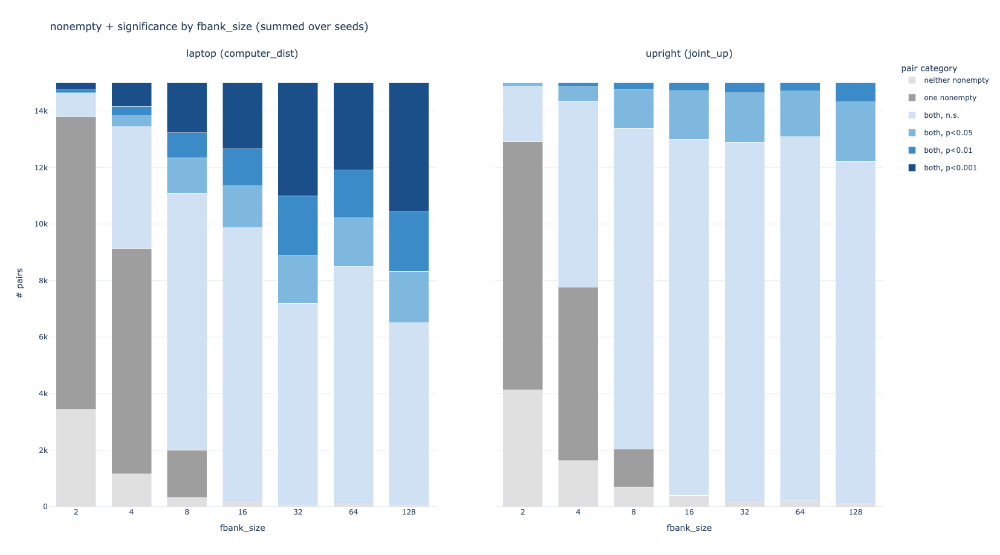
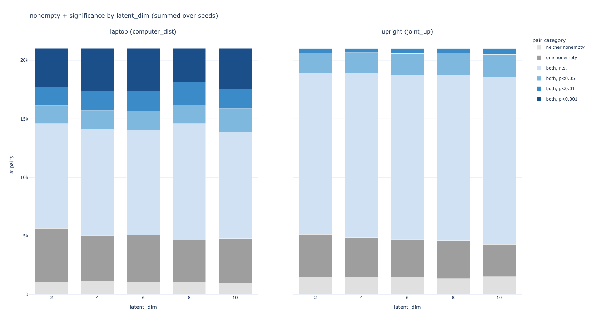
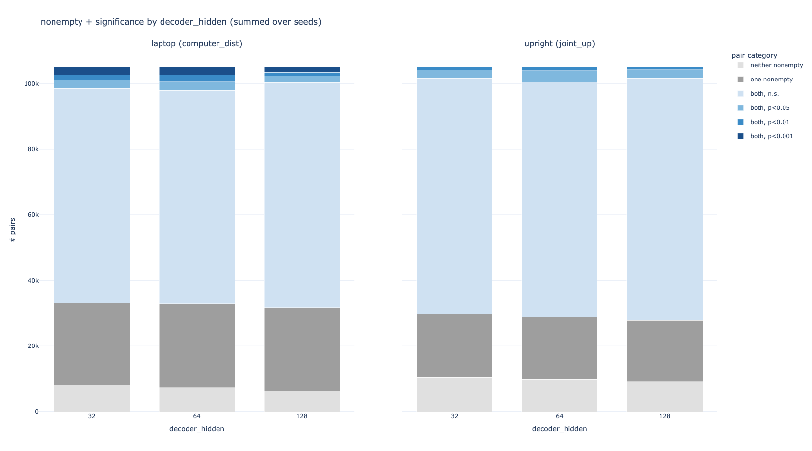
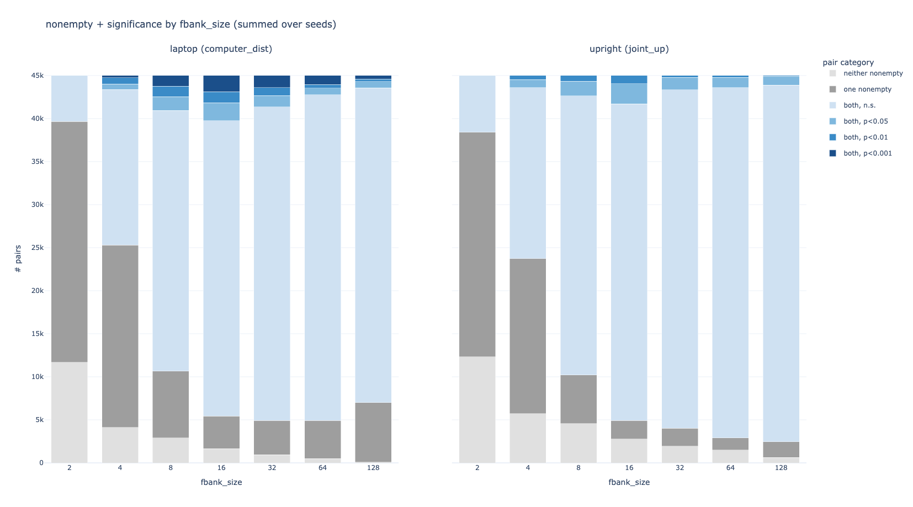
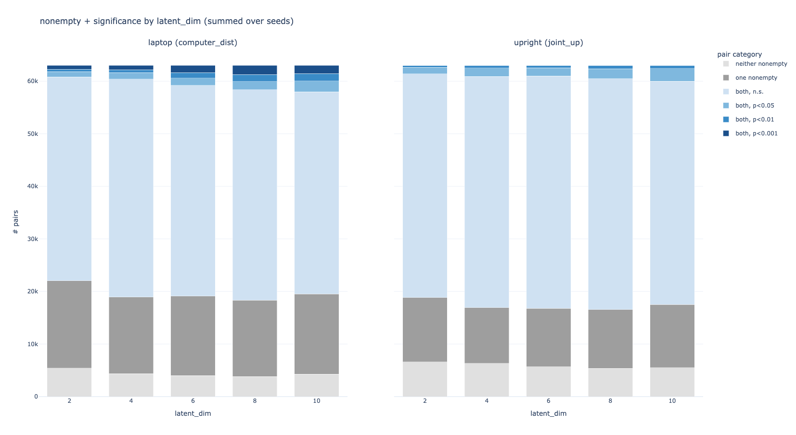

# what i tried
models
* tversky proj with normal triplet loss (L2 distance) `tversky_proj_sirl`
* tversky VAE (tversky projection, linear decoder?)
* (could also compare to tversky sirl, tversky 2 sirl)

sweep
* embed size == num prototypes (`latent_dim`)
* feature bank size (`fbank_size`)

measure
* all possible pairs for min / max joint angle, min / max laptop, and see how often non-empty queries with significant t-test of means happens
	* get {set of trajs with max joint angle feature value} {set of trajs with min joint angle feature value}
	* make all pairs dataset
	* for each pair, make 2x queries from trajectories (min - max, max - min) keep track of:
		* num non-empty queries (0, 1, or 2)
		* if 2: compare two samples via t-test of means
			* report one-sided t-test of means (max - min should be > min - max) stats
			* bool if significant at 0.05, 0.01, etc.

# results
## `tversky_proj_gridrobot`

## `tversky_vae_gridrobot`

**how do the different hyperparams affect how query-able the tversky projection is?**
`tversky_proj`
* latent dim doesn't seem to make a difference
* fbank size seems to be "the bigger the better"...? at least best performance is at >= 128

`tversky_vae`
* larger latent dim seems to be a bit better
* peak at fbank size 16; worse performance before and after
* decoder hidden doesn't seem to matter much

**how much does human similarity labelling help condition the tversky proj to be more query-able?**
* a lot; VAE performance is much worse than supervised (SIRL-like, triplet loss)
