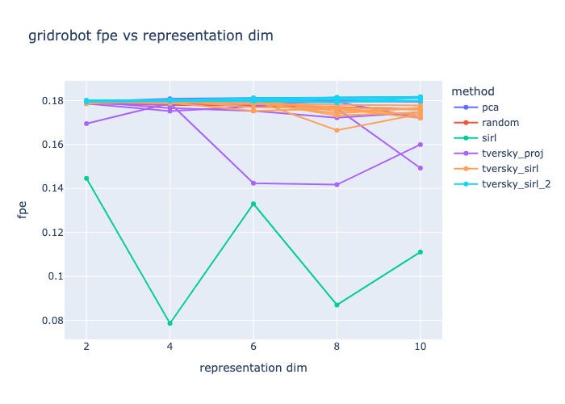
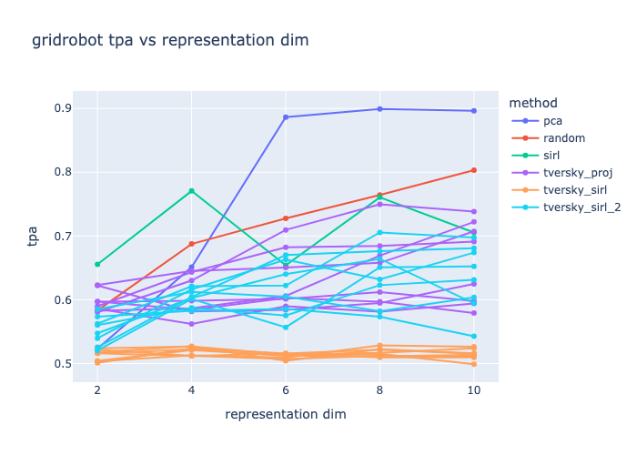
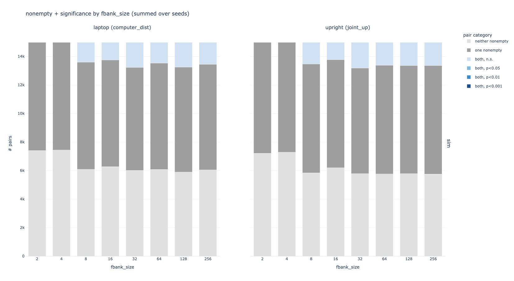
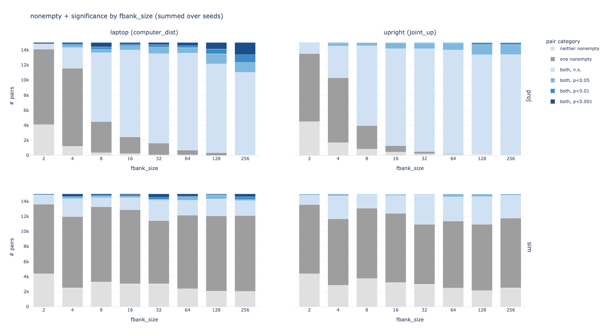

# what i tried
I wanted to compare my new Tversky projection SIRL (replace MLP with TverskyProjection) to the previous SIRL / non-Tversky methods along FPE, TPA. I also wanted to try out my new "how query-able is the Tversky feature bank?" metric (subtract pairs of trajectories with max / min feature values, t test the feature values between them) on my previous Tversky methods.

models:
* pca
* random
* SIRL (normal)
* tversky sim (fka `tversky_sirl`, SIRL + tversky sim in triplet loss)
* tversky proj sim (fka `tversky_sirl_2` - tversky proj instead of MLP encoder + tversky sim (fixed fbank 4) in triplet loss)
* tversky proj (tversky proj instead of MLP encoder, regular triplet loss)
eval:
* fpe
* tpa
* queries
while sweeping:
* feature bank size, for tversky methods
* latent dim

# results
**FPE:**

 * tversky projection with feature bank 128 seems to be the sweet spot, and performs better than random but not as good as SIRL

**TPA:**

* on the TPA front, yet another big win for PCA?!?1
 * tversky projection with feature bank sizes 32, 128 do about as well as SIRL
 * tversky similarity in the loss function isn't great

**query metric:**

(see figs/tversky_*)

TverskySimilarity layer doesn't learn a queryable representation on its own:

Interestingly, it gets more queryable when paired with a TverskyProjection encoder:

But, it doesn't improve the performance of the TverskyProjection encoder on its own. In fact, the TverskyProjection encoder is more query-able with the normal triplet loss function:

And, seems like feature bank size of 256 is about the same (with regards to query-ability) as feature bank size 128.