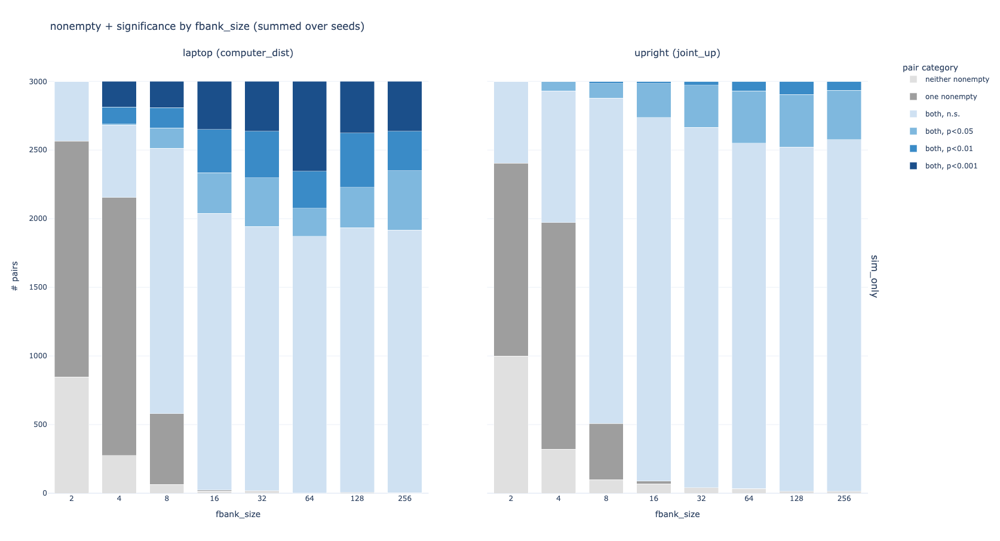
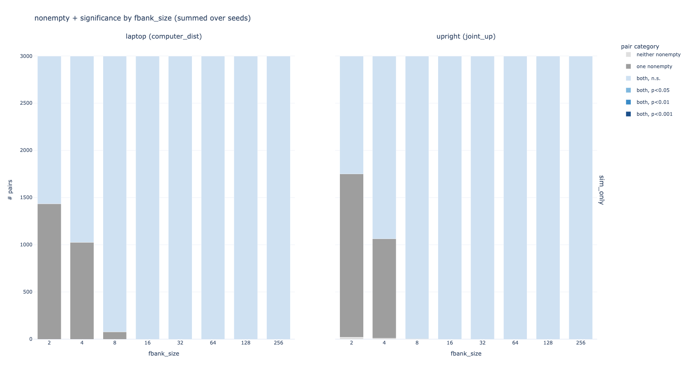
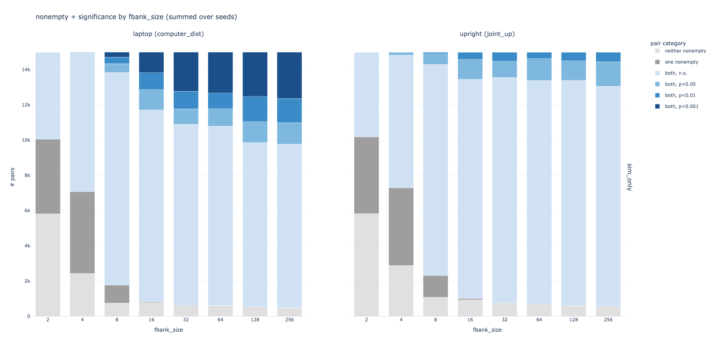
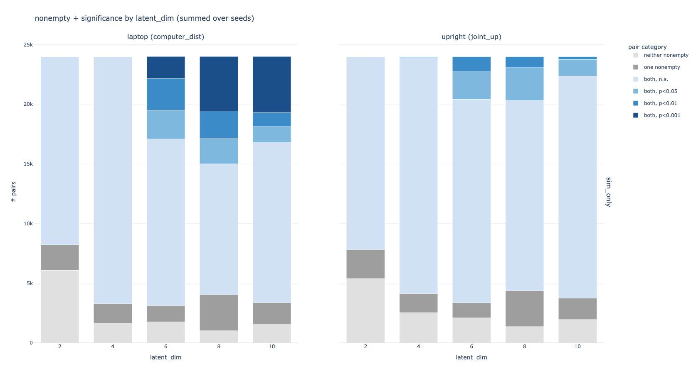
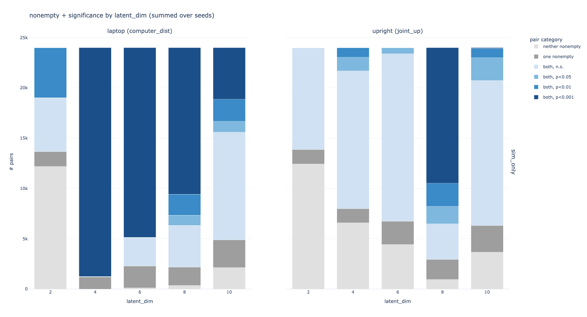

# literally just tversky sim (ljts), contrastive loss on the laptop feature ONLY
in this experiment we train a TverskySimilarity layer directly (no TverskyProjection layer, no simultaneous encoder being trained etc.) using InfoNCE contrastive loss.

we take only trajectories with the max feature value for the laptop feature (call these `hi_trajs`) and trajs with the min feature value for the laptop feature (call these `lo_trajs`). from there we create batches of (hi, hi, many los) and use InfoNCE loss to identify the fellow "hi" traj and push the los farther away.

we test what happens when you pass as input:
* raw 19-dim trajectories (`ljts.yaml`)
* PCA embeddings (`pca_ljts.yaml`)
* SIRL embeddings (`sirl_ljts.yaml`)
* 2D ground-truth feature vectors (`ground_truth_feats_ljts.yaml`)

since we are not training an encoder we do not evaluate FPE or TPA. we look at query-ability as in the previous experiment - for all pairs of (hi, lo) trajs, when we query the tversky feature bank, do they produce sets with significantly different feature values?

**an important note**: 
when running the 2-, 4-dim SIRL embeds i noticed that the TverskySimilarity layer was not learning (loss stuck at ~2.83) because all of the embeddings were all negative. i traced this issue down to the tversky feature initialization, which by default uniformly initializes the weights in the feature bank vectors to [0,1), and then since the TverskySimilarity uses ReLU, all the negative dot products of these feature bank vectors with the SIRL embeds were leading to 0 gradient.

i addressed this by instead initializing the weights of the feature bank vectors to [-1,1]. this fixes the dead gradient problem for all-negative embeds but seems (by observation) to increase the likelihood of dead features in other cases. all runs labelled `0_1_*` use the default initialization to [0,1) and all others which are not specified use the [-1, 1] initialization.

## results
### random init, no training, raw traj as input

### training on raw traj
does not improve upon random:

### ground truth features

doesn't work. loss is frequently 0.0000 for all epochs - no learning. tried increasing tau to 1 which doesn't help.

### pca

does about as well as passing in the raw trajectory.
performs better as dimension increases.
still doesn't improve upon random init, though remains to be seen if random init on lower-dim input does worse

### sirl

does amazingly well??? especially at low dimensions.
maybe because SIRL embeddings are already trained on a kind of contrastive loss (triplet loss), so that they are well-posed to be disentangled by InfoNCE loss?
improves substantially on random init.

## next steps
* why the heck does SIRL work so well?
* training TverskySim doesn't improve query-ability over random -> loss function is not properly hill-climbing on query-ability...
* identify how often no learning occurs (convergence failure)
* check feature bank consistency across queries - does a consistent set of the tversky feats always encode e.g. laptop distance?
* we only evaluated how well tversky sim learns one concept which it was explicitly trained on, using all data available.
    * what is the relationship between the amount of training data and the query-ability?
    * how can we teach multiple concepts (e.g. maybe add concept label $c$ to input)?
* can we use the trained TverskySim layer as a feature extractor, and learn preferences on top of this?
* here we treat laptop as a binary variable, extracting only max / min laptop trajs. how would we handle continuous features?