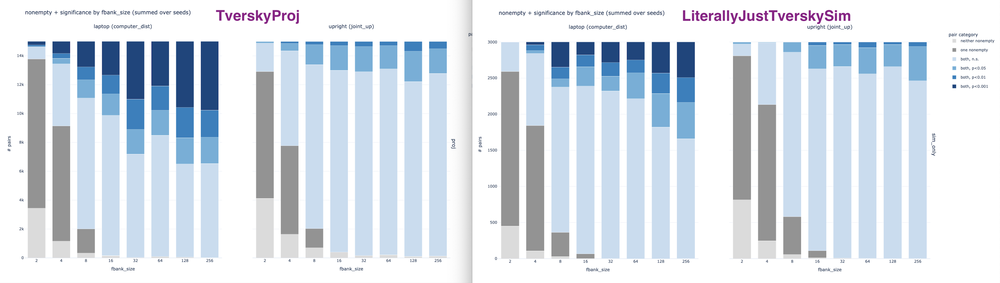

# literally just tversky sim, contrastive loss on the laptop feature ONLY
## wots this
training a TverskySimilarity layer directly (no TverskyProjection layer, no simultaneous encoder being trained etc.) using InfoNCE contrastive loss.

we take only trajectories with the max feature value for the laptop feature (call these `hi_trajs`) and trajs with the min feature value for the laptop feature (call these `lo_trajs`). from there we construct triplets of (hi, hi, lo) and use InfoNCE loss to push hi and hi close to each other and hi, lo far away.

since we have no encoder we cannot evaluate FPE or TPA. we look at query-ability as in the previous experiment - for all pairs of (hi, lo) trajs, when we query the tversky feature bank, do they produce sets with significantly different feature values?

## results

results (query-ability) are comparable (though slightly worse) to that of `tversky_proj` (using TverskyProjection as MLP with regular triplet loss), but with only 56 laptop max trajs and 448 laptop min trajs instead of 1960 (anchor, pos, neg) triplets.
improves significantly upon plugging TverskySim into the SIRL loss while also training the encoder (see `experiments/003-tversky-methods-all-eval/figs/tversky_proj_sim_fbank_size.png` and `experiments/003-tversky-methods-all-eval/figs/tversky_sim_fbank_size.png`).
