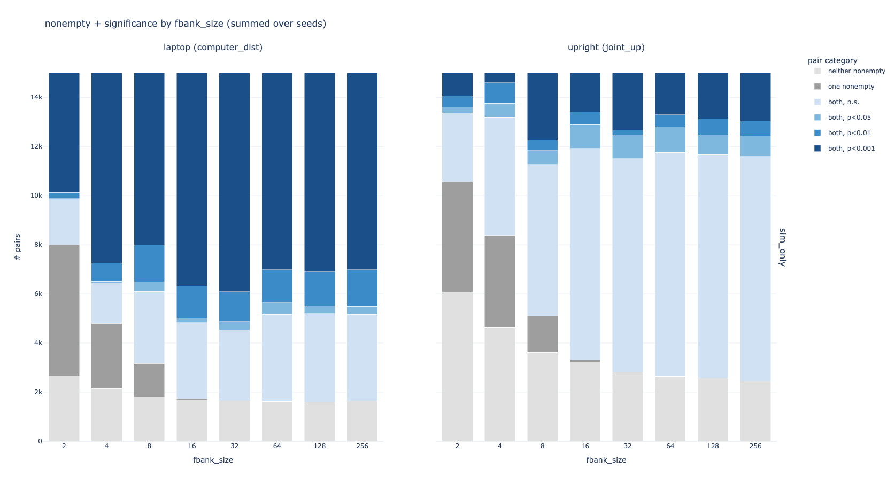
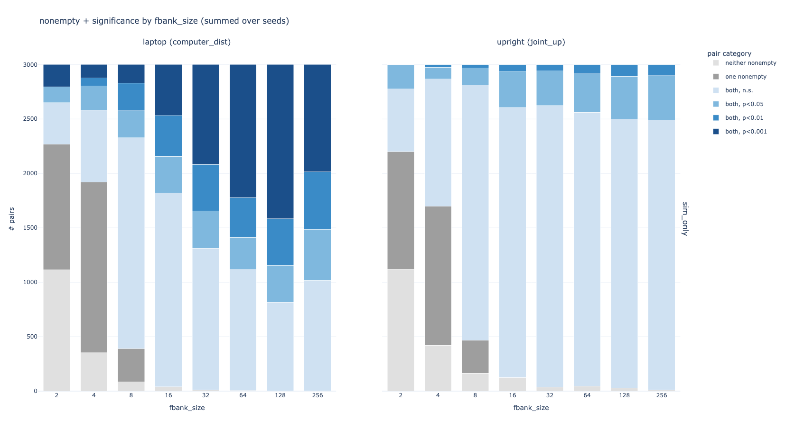
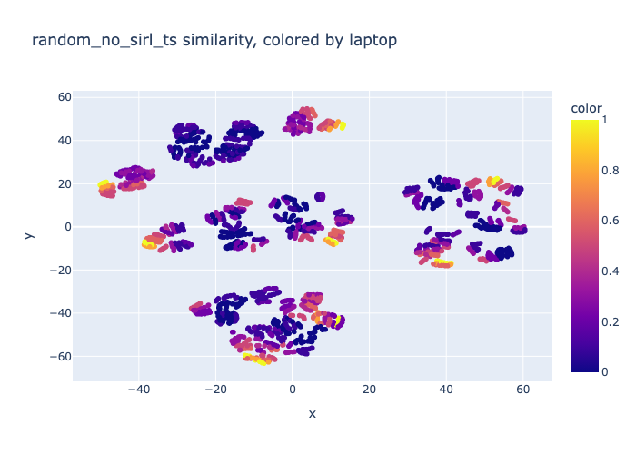
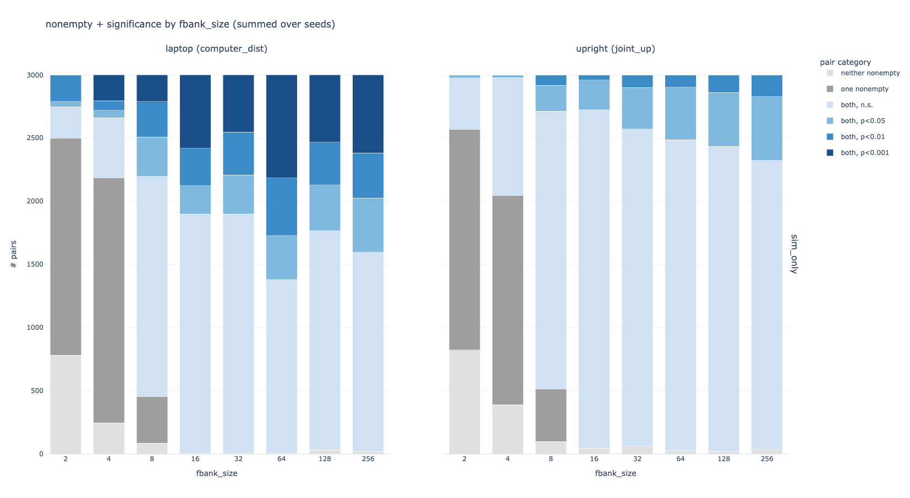
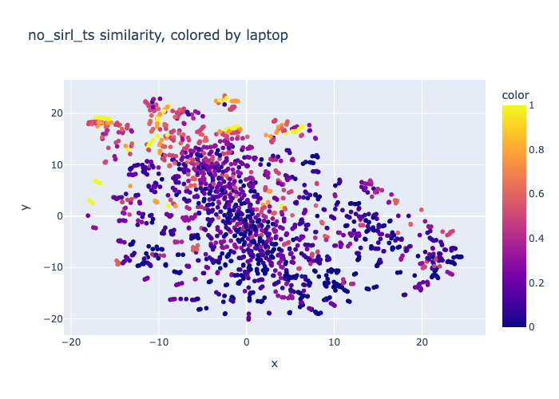

# `005-sirl-tversky`
we have shown (in expt 004) that SIRL input -> training Tversky Sim on (hi, lo) pairs (with InfoNCE loss) does better than raw traj -> random init Tversky Sim, which is a bit apples to oranges but a hopeful sign:

raw trajectory -> random init TverskySim, no training (from expt 004)

SIRL -> TverskySim (trained with InfoNCE loss) (from expt 004)

... so, in this experiment we try to make this comparison more apples to apples, and resolve several bugs / add some new methods along the way.

# methods
* `random.yaml` / `random_no_sirl_ts`: raw trajectory -> random init TverskySim (no training)

	* at high feature bank sizes, structure seems to approach that of raw data / PCA:
	
* `baseline.yaml` / `no_sirl_ts`: raw trajectory -> train TverskySim

	* seems to be learning something, drawing all e.g. high laptop points together, somewhat noisily
	
* raw trajectory -> SIRL (checkpoint, frozen) -> train TverskySim
* raw trajectory -> SIRL -> TverskySim end-to-end, all unfrozen

# new changes
* we train TverskySim on (a,p,n) triplets with triplet loss instead of just (hi, lo) pairs with InfoNCE loss so that we can use the whole dataset and use the same data as SIRL
* TverskySim uses "ratio" instead of "contrast" and normalize=True to produce similarity values bounded between 0 and 1
* triplet loss now uses Pytorch's TripletMarginWithDistanceLoss (again), with distance = 1 - similarity
* alpha, beta are not learned directly, because alpha was being pushed to be negative - we learn `raw_alpha` and `raw_beta` and pass them through a softplus to get alpha, beta for the TverskySim similarity computation
* added new eval method: use TverskySimilarity to compute all-pairs distance matrix and pass this into t-SNE with `metric="precomputed"` to get a vibe for whether or not TverskySimilarity is learning some structure.